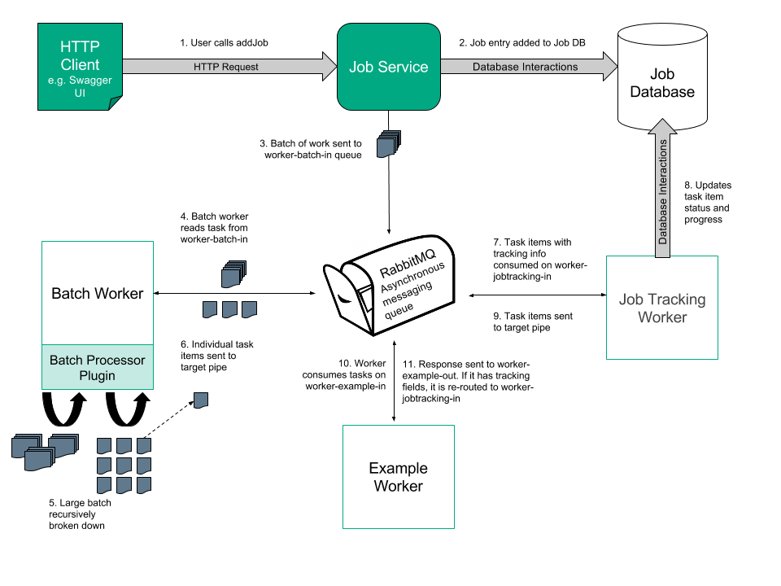

# Architecture

This document outlines the high-level architecture and relationship of the components that work alongside the Job Service and allow for greater control over how background operations are tracked and controlled.

These enhancements allow use of the Worker Framework more widely, for complex operations which are expected to take a significant length of time to complete.

Users can use a new REST Web Service, the CAF Job Service, to have operations sent to the Workers, to check on the progress of these operations, and even to allow the operations to be cancelled.

## Overview

The image illustrates the overall flow and relationship of components in the Job Service.

The pipes represent asynchronous message queues on RabbitMQ.

1. HTTP requests are made to the Job Service via a http client or the Job Service Swagger UI, starting the processing of jobs.
2. The Job Service will add entries to the database for the newly created jobs.
3. The batch of work is sent to RabbitMQ - the Asynchronous messaging service to be consumed by the Batch Worker. In this case the batch is sent to worker-batch-in.
4. The Batch Worker consumes the tasks from worker-batch-in.
5. The large batch of work is recursively broken down into smaller and smaller work items until they are small enough to be sent to individual workers. The recursive nature of the Batch Worker involves sending the tasks which are too large back onto the worker-batch-in queue to be re-processed.
6. The smaller task items are sent to the target pipe, which in this case is worker-example-in. Due to the presence of tracking fields, the task is re-routed to the Job Tracking worker via the worker-jobtracking-in queue.
7. The Job Tracking Worker consumes work items from the tracking pipe - worker-jobtracking-in.
8. The Job Tracking Worker updates task status for the work item in the Job database.
9. The Job Tracking Worker makes a decision:
 - If the `to` field is the same as the `trackTo` field, the task is marked complete in the database and is sent to the target pipe without tracking info.
 - Otherwise, the task is sent to the target pipe with tracking info and will be processed by the worker consuming from the target pipe. In this case, it will be routed to the same queue as in 4 - worker-example-in.
10. A worker consumes messages from the target pipe and processes the task. In this case the Example Worker consumes from worker-example-in.
11. If there is tracking info present, tasks are re-routed to the tracking pipe. Otherwise, the task has completed and the response will be sent to output queue, in this case worker-example-out.

## Job Service

The Job Service is a RESTful web service which runs in a container with a base Tomcat image. 

It acts as the entry-point to allow background operations to be initiated, tracked, and cancelled.

Users interact with the Swagger UI page to make GET, POST, PUT and DELETE HTTP requests to the Job Service, which in turn interacts with the Job Service Database and return responses to the user.

The specification for the Job Service Web API is defined in the [swagger.yaml](https://github.hpe.com/caf/job-service-contract/blob/develop/src/main/resources/com/hpe/caf/services/job/swagger.yaml) file in the [job-service-contract](https://github.hpe.com/caf/job-service-contract) project.

The Job Service itself is stateless, so that it can be auto-scaled in future.

## Batch Worker

The Batch Worker is an unusual worker in that it may dispatch multiple messages for each message that it receives. (Most workers only dispatch a single Completion or Failure message for each work packet that is sent to them.)

Upon providing a batch processor plugin, a batch can be interpreted by the Batch Worker, splitting it into smaller batches or individual items of work upon which the service can act. The process of batch splitting is scaled elastically using the autoscaler, allowing sub-batches of a larger batch to be processed in parallel. The individual items of work emerge and go into the RabbitMQ queue, which is defined in the job and processed by workers. The workers also scale elastically based on the load.

### Batch Worker Walk-through

When the Batch Worker receives a batch to process, it interprets the batch definition string and splits it up into either:

1. a set of batch definitions representing smaller batches, OR
2. a set of items

If it determines to split the batch into a set of smaller batches, it then constructs messages which are directed back towards itself and dispatches them to the input pipe that the Batch Worker itself is listening on (not to the pipe specified by the `targetPipe` field).

If it instead determines to split the batch into a set of items, then it generates and dispatches task messages to the `targetPipe`.

## Worker Framework

When a Worker receives a message to be processed then the Worker Framework first compares the current time to the time specified in the statusCheckTime field. If the expiry time has passed then the statusCheckUrl is used to re-check the job status.

* If the job has been cancelled or aborted then the message is simply discarded and not processed.
* If the specified url could not be reached for some reason then this is logged as a warning, but the work package is still progressed on the assumption that the job is still active.
* If the job has been confirmed to still be active, then the work package is progressed, and when the Worker ultimately dispatches another message relating to this task, it has the statusCheckTime field updated to a new value, so that there is a chance that a downstream worker will not also have to repeat this work and check the job status again.

The `to` field is automatically set by the Worker Framework and is the destination pipe where the sender intends the message to be sent.

After the Worker Framework has checked that the task is still active, but before it instantiates the actual Worker code, it checks the `to` field, to confirm that the message was actually intended for this worker.

* If the message was intended for it (i.e. if the to field is set to the pipe that the Worker is consuming) then the Worker Framework continues to process the message as normal, using the existing interfaces.
* If the message was not intended for it (i.e. if the to field is not set to the pipe that the Worker is consuming), then the Worker Framework re-routes the message to the destination pipe.

## Job Tracking Worker

The Job Tracking Worker is special in that it is both a normal Worker that receives messages that were intended for it (although they are Event Messages rather than Document Messages), and it is also acts as a Proxy, routing messages that were not ultimately intended for it to the correct Worker (although the actual message forwarding is done by Worker Framework code).

Messages typically arrive at the Job Tracking Worker because the pipe that it consumes messages from is specified as the `trackingPipe` (the Worker Framework is triggered to re-route output messages to the Job Tracking Worker if the tracking fields are present).

When the Job Tracking Worker receives a success message which is to be proxied (i.e. one where the taskStatus is RESULT_SUCCESS or NEW_TASK and the to field is not the pipe that the worker itself is listening on), then it checks whether the trackTo pipe is the same as the to pipe.

* If it is, then the task is complete, and it is marked complete in the Job Database.
* If it is not, then the Job Database is updated to reflect that the task is still progressing but is not complete.

The Job Tracking Worker is able to recognise Failure messages and Retry messages which are being proxied, and update the Job Database appropriately.

## Job Database

We use a **PostgreSQL** database to store the Job information.

### Job Table

This table stores information on the jobs that are requested. Entries are added by the Job Service and updated by the Job Tracking Worker.

| **Column**     | **Data Type** | **Nullable?** | **Primary Key?** |
|----------------|---------------|---------------|------------------|
| JobId          | String        | No            | Yes              |
| Name           | String        | Yes           |                  |
| Description    | String        | Yes           |                  |
| Data           | String        | Yes           |                  |
| Create_Date    | DateTime      | No            |                  |
| JobStatus      | job_status    | No            |                  |
| FailureDetails | ---           | Yes           |                  |
| IsComplete     | Boolean       | Yes           |                  |
| Job_Hash       | Integer       | Yes           |                  |

### Task Tables

The task tables have the same structure as the Job Table. There is one task table per job. It is created when the first subtask is reported, and deleted when the job has completed successfully. If the job fails we retain it for a period of time for examination.

When a task is marked complete, we check whether it means that the parent task (or the job if it is the top level) can also be marked complete.
