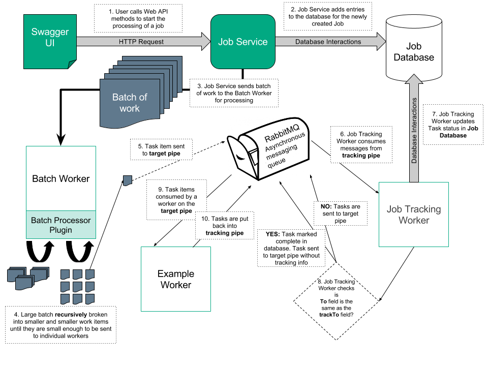

# Architecture

This document outlines the high-level architecture of facilities added to CAF and to the CAF Worker Framework to allow for greater control over how background operations are tracked and controlled.

These enhancements allow use of the Worker Framework more widely, for complex operations which are expected to take a significant length of time to complete.

Users can use a new REST Web Service, the CAF Job Service, to have operations sent to the Workers, to check on the progress of these operations, and even to allow the operations to be cancelled.

The JIRA Epic for this can be found at [https://jira.autonomy.com/browse/CAF-596](https://jira.autonomy.com/browse/CAF-596).

## Overview



## Job Service


The Job Service is a RESTful web service which runs in a container with a base Tomcat image. 

It acts as the entry-point to allow background operations to be initiated, tracked, and cancelled.

Users interact with the Swagger UI page to make Get, Post, Put and Delete HTTP requests to the Job Service, which in turn interacts with the Job Service Database and return responses to the user.

The specification for the Job Service Web API is defined in the [swagger.yaml](https://github.hpe.com/caf/job-service-contract/blob/develop/src/main/resources/com/hpe/caf/services/job/swagger.yaml) file in the [job-service-contract](https://github.hpe.com/caf/job-service-contract) project.

The Job Service itself is stateless, so that it can be auto-scaled in future.

## Batch Dispatch Worker

This is an unusual worker in that, much like the Keyview Worker (when it is installed with the Policy Plugin), it may dispatch multiple messages for each message that it receives. (Most workers only dispatch a single Completion or Failure message for each work packet that is sent to them.)

### Batch Worker Message Structure

The structure of the messages to be sent are defined in a **worker-batch-shared** package.

batchDefinition: String <br>
batchType: String <br>
taskMessageType: String <br>
taskMessageParams: Map&lt;String, String&gt; <br>
targetPipe: String <br>

| Field                 | Description |
|-----------------------|-----------------------------------------------------------------------------------------------------------------------------------------------------------------------------------------------------------------------------------------------------------------------------------------------------------------------------------------------------------------------------------------------------------------------------------------------------------------------------------------------------------------------------------------------------------------------------------------------------------------------------------------------------------------------------------------------------------------------------------------------------------------------------------------------------------------------------------------------|
| **batchDefinition**   | This is the definition of the batch. For example, it might be a string like "workbook == 5". The definition string is interpreted by the type specified to the 'batchType' field.  **Example:** workbook == 5 |
| **batchType**         | This is the type that is used to interpret the batch definition string. The Batch Worker creates an instance of this class to interpret the definition string, so the specified class must be made available on the Batch Worker's classpath. |
| **taskMessageType**   | This is a factory type that is used to construct the TaskMessage for each item of the batch. This string is passed to the instance of the 'batchType' object and it creates an instance of this class, so only types which have been deployed may be specified.  Obviously this type is highly tied to the 'targetPipe' field, in that the messages produced by this object must be compatible with the workers they are being sent to.  The interface that this type must implement, and the services provided by the 'batchType' plugin to it, are not defined at the BatchWorker level - that is an internal detail between the two objects. |
| **taskMessageParams** | This is a set of named parameters to be passed to the specified TaskMessage builder (i.e. the factory type specified by the 'taskMessageType' parameter). Their meaning is dependant on the type specified. |
| **targetPipe**        | A message is constructed for each item of the batch. This field specifies the pipe (channel or queue) where these per-item messages are to be forwarded to.  **Example:** workflow-in |

### Interfaces

#### BatchWorkerPlugin

This interface is implemented by the type specified to the batchType field. Its processBatch() method is called by the Batch Worker and is expected to interpret the batch definition string, and to make multiple calls to the supplied BatchWorkerServices object in line with how the batch needs to be broken down.

It also returns an identifying string that is used in the batch type field of the BatchWorkerTask to load the plugin.

```
interface BatchWorkerPlugin
{
    void processBatch (
        BatchWorkerServices bwServices,
        String batchDefinition,
        String taskMessageType,
        Map&lt;String, String&gt; taskMessageParams
    );

    String getIdentifier();
}
```

#### BatchWorkerServices

An implementation of this type is contained in the Batch Worker code. It is passed to the batchType object so that it can utilise services provided by the Batch Worker.

```
interface BatchWorkerServices
{
    // Creates a new sub-task which represents a smaller batch
    void registerBatchSubtask(String batchDefinition, String batchType, String taskMessageType, Map&lt;String, String&gt; taskMessageParams, String targetPipe);

    // Creates a new sub-task for a single item
    void registerItemSubtask(String taskClassifier, int taskApiVersion, Object taskData);

}
```

### Batch Worker Walk-through

When the Batch Worker receives a batch to process, it first constructs an instance of the type that is specified by the `batchType` field. This type implements the `BatchWorkerPlugin` interface.

It then constructs its own internal `BatchWorkerServicesImpl` object - an object which implements the `BatchWorkerServices` interface.

It calls `processBatch()`, passing in the services object and the other parameters.

The implementation of the `processBatch()` method interprets the batch definition string and split it up into either:

1. a set of batch definitions representing smaller batches, OR
2. a set of items

If it determines to split the batch into a set of smaller batches, then it makes a series of calls to the `registerBatchSubtask()` method. The Batch Worker then constructs messages which are directed back towards itself and dispatch them to the input pipe that the Batch Worker itself is listening on (not to the pipe specified by the `targetPipe` field).

If it instead determines to split the batch into a set of items, then it first constructs an instance of the type that is specified by the `taskMessageFactory` field, and then use it to generate task messages that are appropriate to be sent to the worker listening on the `targetPipe`. It calls the `registerItemSubtask()` method for each item, and the Batch Worker dispatches the messages to the pipe specified by the `targetPipe` field.

### Subtask Identification

If the tracking fields are present, that the implementation of the registerSubtask() methods indicates that the task is a subtask by appending a subtask identifier to the taskId. So if the taskId was J5.1 and this is the second subtask, it assigns the taskId J5.1.2. Also note that the subtask's `trackTo` pipe aren't necessarily the same as the parent task's `trackTo` pipe, if indeed it has one.

## Worker Framework Enhancements

Additional 'tracking' fields have been added to the `TaskMessage` structure:

tracking: TrackingInfo

```
TrackingInfo {
    taskId: String
    statusCheckTime: dateTime
    statusCheckUrl: String
    trackingPipe: String
    trackTo: String
}
```
| Field               | Description |
|---------------------|----------------------------------------------------------------------------------------------------------------------------------------------------------------------------------------------------------------------------------------------------------------------------------------------------------------------------------------------------------------------------------------------------------------------------------------------------------------------------------------------------------------------------------------------------------------------------------------------------------------------------------------------------------------------------------------------------------------------------------------------------------------------|
| **taskId**          | This is an identifier assigned for tracking the task. This is the letter J followed by the job id, and then followed by multiple numeric subtask ids separated by periods.  **Example:** J5.1.2 |
| **statusCheckTime** | This is the time after which it is appropriate to try to confirm that the task has not been cancelled or aborted. |
| **statusCheckUrl**  | This is the url to use to check whether the job has been cancelled or aborted. |
| **trackingPipe**    | This is the pipe output messages relating to this task are be sent, regardless of their nature (i.e. whether they are Reject messages, Retry messages, Response messages, or some other type of message). It is the responsibility of the Job Tracking Worker, which consumes messages sent to this pipe, to forward the message to the intended recipient, which is indicated by the 'to' field (mentioned later).  **Note:** One exception to this is where the tracking pipe specified is the same pipe that the worker itself is consuming messages from. If this is the case then the tracking pipe is ignored. It likely means that this is the Job Tracking Worker. |
| **trackTo**         | This is the pipe where tracking is to stop. If the Worker Framework is publishing a message to this pipe then it removes the 'tracking' fields, as we are not interested in tracking from this point. |


When a Worker receives a message to be processed then the Worker Framework first compares the current time to the time specified in the `statusCheckTime` field. If the expiry time has passed then the `statusCheckUrl` is used to re-check the job status.

- If the job has been cancelled or aborted then the message is simply discarded and not processed.
- If the specified url could not be reached for some reason then this is logged as a warning, but the work package is still progressed on the assumption that the job is still active.
- If the job has been confirmed to still be active, then the work package is progressed, and when the Worker ultimately dispatches another message relating to this task, it has the `statusCheckTime` field updated to a new value, so that there is a chance that a downstream worker will not also have to repeat this work and check the job status again.

### Message Forwarding

There is an additional `to` field in the structure:

`to: String`

This field is automatically set by the Worker Framework and is the destination pipe where the sender intends the message to be sent. Note that whilst the `taskClassifier` field indicates the shape of the message, there could still be multiple pools of workers capable to processing a message of a given shape, so this new `to` field is simply being explicit about the target pipe.

After the Worker Framework has checked that the task is still active, but before it instantiates the actual Worker code, it checks the `to` field, to confirm that the message was actually intended for this worker.

- If the message was intended for it (i.e. if the `to` field is set to the pipe that the Worker is consuming) then the Worker Framework continues to process the message as normal, using the existing interfaces.
- If the message was not intended for it (i.e. if the `to` field is not set to the pipe that the Worker is consuming), then the Worker Framework checks if the Worker code supports a new interface (to be defined) and takes instructions through this interface with regard to how the message should be processed. The worker code examines the message, and instructs the framework to:
    - discard the message
    - publish the message to the destination pipe (this is be the default)

## Job Tracking Worker

The Job Tracking Worker is special in that it is both a normal Worker that receives messages that were intended for it (although they are Event Messages rather than Document Messages), and it is also acts as a Proxy, routing messages that were not ultimately intended for it to the correct Worker (although the actual message forwarding is be done by Worker Framework code).
batchDefinition
Messages typically arrive at the Job Tracking Worker because the pipe that it is consuming messages from is specified as the `trackingPipe` (which triggers the Worker Framework to re-route output messages).

This Worker performs the following functions:

1. Checks for task cancellation (as all workers do)
2. Reports the progress of the task to the Job Database
3. If the job is active, forwards messages to the correct destination pipe

For more intricate details visit the [Job Tracking Worker](https://github.hpe.com/caf/worker-jobtracking) repository.

### Progress Reporting

When the Job Tracking Worker receives a success message which is to be proxied (i.e. one where the `taskStatus` is `RESULT_SUCCESS` or `NEW_TASK` and the `to` field is not the pipe that the worker itself is listening on), then it checks whether the `trackTo` pipe is the same as the `to` pipe.

- If it is, then the task is complete, and it is marked complete in the Job Database.
- If it is not, then the Job Database is updated to reflect that the task is still progressing but is not complete. Unfortunately we can only tell that the task is progressing; we cannot get an estimated percentage completion, as we don't know how many more workers it will have to go through before it gets to the `trackTo` pipe, or how long each worker will take.

The Job Tracking Worker is able to recognise Failure messages and Retry messages which are being proxied, and update the Job Database appropriately.

_[The Partial Progress Updating functionality described in this paragraph is not to be included in the initial implementation]._ The Job Tracking Worker also receives Progress Update messages sent directly to it by workers which have been updated to do so. These are messages which simply contain the task identifier and an estimated Percentage Completion. The Job Tracking Worker updates the Job Database accordingly. It might make sense to send always send a 0% Complete message from the Worker Framework before a Worker starts processing a task, but apart from that it would of course only make sense to update those workers which tend to require a lot of time to progress tasks (such as the Speech Worker for example).

## Job Database

We use a **PostgreSQL** database to store the Job information.

### Job Table

This table stores information on the jobs that are requested. Entries are added by the Job Service and updated by the Job Tracking Worker.

| **Column**     | **Data Type** | **Nullable?** | **Primary Key?** |
|----------------|---------------|---------------|------------------|
| CreateDate     | DateTime      |               |                  |
| FailureDetails | ---           | Yes           |                  |
| IsComplete     | Boolean       |               |                  |
| JobId          | String        |               | Yes              |

### Task Tables

The task tables has the same structure as the Job Table. There is one task table per job. It is created when the first subtask is reported, and deleted when the job has completed successfully. If the job fails we retain it for a period of time for examination.

When a task is marked complete, we check whether it means that the parent task (or the job if it is the top level) can also be marked complete.
