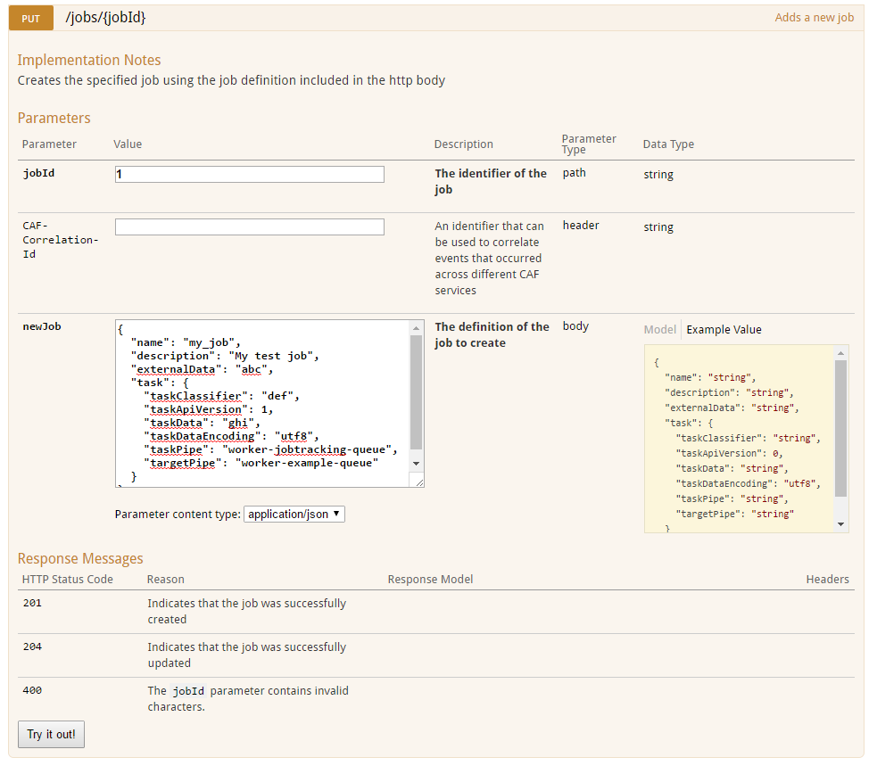
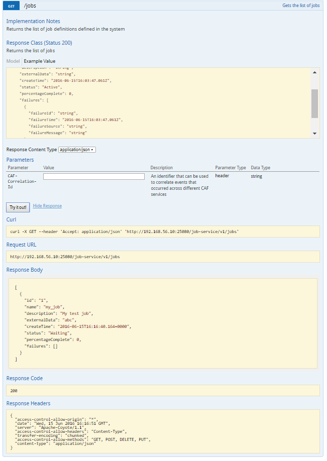
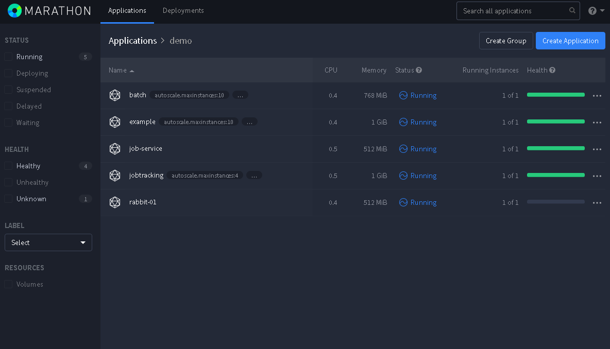
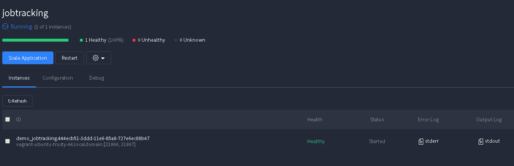

# Getting Started

## Deploying the CAF Job Service

### Docker Images

In order to deploy the CAF Job Service you need to download docker images for both the Job Service and the Job Service Database Installer from Artifactory.

In your docker virtual machine run the two commands:

`docker pull rh7-artifactory.hpswlabs.hp.com:8443/caf/job-service:1.0`

`docker pull rh7-artifactory.hpswlabs.hp.com:8443/caf/job-service-db-installer:1.0`

### To install the Job database:

Make sure your own hibernate compatible database is running (i.e. PostgreSQL).

1. First, find the image id of the job-service-db-installer downloaded above and run the job-service-db-installer container with the command:

`docker run -i -t <job-service-db-installer Image ID> bash`

2. Then execute the installer jar from within the container using the command below, replacing the options with your own database setup:

`java -jar /job-service-db.jar -db.connection jdbc:postgresql://localhost:5432 -db.name jobservice -db.pass root -db.user postgres -fd`

> Note: if you aren't running the database in your Docker virtual machine, make sure you enable client authentication and allow TCP/IP socket and restart your database server. E.g. for Postgres setup: <br>
> * `vi /var/lib/pgsql/data/pg_hba.conf` append the line `host    all             all             0.0.0.0/0            md5` <br>
> * `vi /var/lib/pgsql/data/postgresql.conf` change the listen addresses to `listen_addresses='*'`

### Marathon Loader

To start the Job Service docker container use Marathon loader with the configuration files below.

Download the marathon-loader artifact from Nexus or Artifactory:

repository: [http://cmbg-maven.autonomy.com/nexus/content/repositories/releases/](http://cmbg-maven.autonomy.com/nexus/content/repositories/releases/)

repository mirror: [http://rh7-artifactory.hpswlabs.hp.com:8081/artifactory/policyengine-release/](http://rh7-artifactory.hpswlabs.hp.com:8081/artifactory/policyengine-release/)

> groupId: com.hpe.caf <br>
> artifactId: marathon-loader <br>
> version: 2.1 <br>
> classifier: jar-with-dependencies <br>

#### Job Service Marathon Loader Configuration

Download the [configuration files](https://github.hpe.com/caf/chateau/tree/develop/services/job-service/configuration-files) to a folder in the same directory as marathon loader jar i.e. `marathon-template-config`.

Download the [marathon-job-service-container.json](https://github.hpe.com/caf/chateau/blob/develop/services/job-service/marathon-templates/marathon-job-service-container.json) to a folder in the same directory as marathon loader jar i.e. `marathon-template-json`.

Download the [properties.json](https://github.hpe.com/caf/chateau/blob/develop/services/job-service/properties.json) file and place it in the same directory as marathon loader jar. You will need to change the properties to fit your own setup.

For documentation on the properties see [properties.md](https://github.hpe.com/caf/chateau/blob/develop/services/job-service/properties.md).

#### Launching Job Service using Marathon loader

Run the marathon loader application changing the command line options to point to the relevant locations:

`java -jar marathon-loader-2.1-jar-with-dependencies.jar -m "./marathon-template-json" -v "./marathon-properties.json" -e http://localhost:8080 -mo "./marathon-config"`

* -m specifies the location of the marathon-template-json folder
* -v specifies the location of the marathon-properties.json file
* -e is used to specify the Marathon endpoint
* -mo specifies the location where the generated marathon configs will be output

This will launch the container which includes both the Job Service Web API and the Job Service Swagger UI.

## Using the Job Service Web API

A handy user interface is provided and accessible on the same host and port as the Web service. The Swagger UI page will be accessible at the following address:

`http://<docker-host-address>:<service-port specified in properties.json>/job-service-ui`

### Add a job

Expand the PUT /jobs/{jobId} method. Enter value for jobId. Click on the example value box on the right to fill in the
newJob body. Edit these fields with your own details:

`name`: name of the job
`description`: description of the job
`externalData`: external data
`taskClassifier`: classifier of the task
`taskApiVersion`: API version of the task
`taskData`: data of the task (include a batch definition if sending to the batch worker)
`taskDataEncoding`: encoding of the task data e.g. `utf8`
`taskPipe`: name of rabbit queue feeding messages to the first worker
`targetPipe`: name of the final worker's output queue where tracking will stop

Press `Try it out!`, the result code will show whether the addition of the job is a success or not (201 if job is successfully added or 204 if job is successfully updated).



### Get jobs

Expand the GET /jobs method. Press `Try it out!`. The list of jobs in the system will appear in the response body and you will be able to see the job you just created.



## Deploying End-To-End System

### Docker Images

In order to run an end-to-end Job Service system you need to download the Job Service docker image and set up your Job Service Database as explained above. There are a few other key components. You must download the following docker images from Artifactory:

In your docker virtual machine run the commands:

`docker pull rh7-artifactory.hpswlabs.hp.com:8443/caf/worker-batch:1.6-SNAPSHOT`

`docker pull rh7-artifactory.hpswlabs.hp.com:8443/caf/worker-jobtracking:1.5-SNAPSHOT`

`docker pull rh7-artifactory.hpswlabs.hp.com:8443/caf/worker-example:1.0-SNAPSHOT`

### Marathon Loader Configruation

* Download the configuration files for the components from the following locations and place them into your `marathon-template-config` folder.

    * Batch Worker [configuration files](https://github.hpe.com/caf/chateau/tree/develop/services/batch-worker/configuration-files).

    * Jobtracking Worker [configuration files](https://github.hpe.com/caf/chateau/tree/develop/services/jobtracking-worker/configuration-files).

    * Example Worker [configuration files](https://github.hpe.com/caf/chateau/tree/develop/services/example-worker/configuration-files).

* Download the following marathon json files to your `marathon-template-json` folder.

    * Batch Worker [marathon-batch-worker.json](https://github.hpe.com/caf/chateau/blob/develop/services/batch-worker/marathon-templates/marathon-batch-worker.json).

    * Jobtracking Worker [marathon-jobtracking-worker.json](https://github.hpe.com/caf/chateau/blob/develop/services/job-service/marathon-templates/marathon-jobtracking-worker.json).

    * Example Worker [marathon-example-worker.json](marathon-example-worker.json).

    * RabbitMQ [marathon-rabbit.json](https://github.hpe.com/caf/worker-example-container/blob/develop/configuration/marathon-template-json/marathon-rabbit.json)

* Add the properties specific to each component to your properties.json file in the same directory as marathon loader. This supplies the properties to the templates.

    * Batch Worker [properties.json](https://github.hpe.com/caf/chateau/blob/develop/services/batch-worker/properties.json).

    * Example Worker [marathon-properties.json](https://github.hpe.com/caf/worker-example-container/blob/develop/configuration/marathon-properties.json).

    * Properties for the Jobtracking Worker are already included in the Job Service properties file: [properties.json](https://github.hpe.com/caf/chateau/blob/develop/services/job-service/properties.json).

### Other Prerequisites

* Download the `worker-batch-plugins-package-1.0.tar.gz` from Nexus [here](http://cmbg-maven.autonomy.com/nexus/service/local/artifact/maven/redirect?r=releases&g=com.hpe.caf.worker.batch&a=worker-batch-plugins-package&v=1.0&e=tar.gz) and rename this to `batch-plugins.tar.gz`. This contains the plugins necessary for using the Batch Worker. Place this in a `batch-plugins` folder in your shared folder with your docker host machine. Specify the location from the Docker VM to the file as the `"batch-plugin-location"` property in marathon-properties.json.

* You will also need dummy data in datastore and a datastore reference to this data. Dummy data can be uploaded via the document-generator in Perforce.

* You must now tailor the marathon properties to your fit your own setup. By the end you will have a properties.json file like this with your own setup details:

```
{
	"docker-registry": "<ENVIRONMENT_VALUE: Uses environment option: docker-registry>",
	"marathon-group": "<CONFIGURATION_VALUE: uses configuration option: marathon-group>",
	"service-groupname": "batch-worker",
	"force-pull": "<CONFIGURATION_VALUE: Uses environment option: force-pull>",
	"docker-login-config": "<ENVIRONMENT_VALUE: Uses environment option: docker-login-config>",
	"marathon-uris-root": "<ENVIRONMENT_VALUE: Uses environment option: marathon-uris-root>",
	"service-config-location": "<CONFIGURATION_VALUE: Uses environment option: service-config-location>",

	"storage-api-haproxy-name": "<ENVIRONMENT_VALUE: uses environment option from storage-server.json: storage-api-haproxy-name>",
	"storage-api-https-service-port": "<ENVIRONMENT_VALUE: uses environment option from storage-server.json: storage-api-https-service-port>",
	"idm-keycloak-hostname": "<ENVIRONMENT_VALUE: uses environment option: idm-keycloak-hostname>",
	"idm-keycloak-https-service-port": "<ENVIRONMENT_VALUE: uses environment option: idm-keycloak-https-service-port>",
	"idm-keycloak-app-client-id": "<CONFIGURATION_VALUE: uses configuration option in keycloak.json: idm-keycloak-app-client-id>",
	"idm-keycloak-app-client-secret": "<CONFIGURATION_VALUE: uses configuration option in keycloak.json: idm-keycloak-app-client-secret>",
	"idm-keycloak-realm": "<CONFIGURATION_VALUE: uses configuration option in keycloak.json: idm-keycloak-realm>",
	"idm-dataprocessing-worker-username": "<ENVIRONMENT_VALUE: uses environment option in idm.json: idm-dataprocessing-worker-username>",
	"idm-dataprocessing-worker-password": "<ENVIRONMENT_VALUE: uses environment option in idm.json: idm-dataprocessing-worker-password>",

	"rabbit-host": "<ENVIRONMENT_VALUE: Uses environment option: rabbit-host>",
	"rabbit-user": "<ENVIRONMENT_VALUE: Uses environment option: rabbit-user>",
	"rabbit-password": "<ENVIRONMENT_VALUE: Uses environment option: rabbit-password>",
	"rabbit-port": "<ENVIRONMENT_VALUE: Uses environment option: rabbit-port>",
	"rabbit-management-api-port": "<ENVIRONMENT_VALUE: Uses environment option: rabbit-management-api-port>",
	"rabbit-maxattempts": "3",
	"rabbit-backoffInterval": "5",
	"rabbit-maxBackoffInterval": "15",

	"batch-cpus": "0.4",
	"batch-mem": "768",
	"batch-java-mem-min": "512",
	"batch-java-mem-max": "512",
	"batch-8080-serviceport": "33080",
	"batch-8081-serviceport": "33081",
	"batch-autoscale.metric": "rabbitmq",
	"batch-autoscale.scalingprofile": "default",
	"batch-autoscale.maxinstances": "10",
	"batch-autoscale.mininstances": "1",
	"batch-healthcheck-graceperiodseconds": "300",
	"batch-healthcheck-intervalseconds": "120",
	"batch-healthcheck-maxconsecutivefailures": "5",
	"batch-healthcheck-timeoutseconds": "20",
	"batch-version": "1.3",
	"batch-threads": "1",
	"batch-cache-expire": "120",
	"batch-inputqueue": "<CONFIGURATION_VALUE: Use configuration option: batch-inputqueue>",
	"batch-outputqueue": "<CONFIGURATION_VALUE: Use configuration optionL batch-outputqueue>",
	"batch-plugin-location": "batch-plugin-location",

	"job-service-cpus": "0.5",
	"job-service-mem": "512",
	"job-service-resultSizeThreshold": "1024",
	"job-service-threads": "1",
	"job-service-instances": "1",
	"job-service-version": "1.0",
	"job-service-8080-serviceport": "25080",
	"job-service-healthcheck-graceperiodseconds": "300",
	"job-service-healthcheck-intervalseconds": "120",
	"job-service-healthcheck-maxconsecutivefailures": "5",
	"job-service-healthcheck-timeoutseconds": "20",
	"job-service-java-mem-min": "256",
	"job-service-java-mem-max": "256",
	"job-service-status-check-time": "5",
	"job-service-web-service-url": "<ENVIRONMENT_VALUE: use environment option job-service-web-service-url>",

	"jobtracking-inputqueue": "<CONFIGURATION_VALUE: use configuration option jobtracking-inputqueue>",
	"jobtracking-outputqueue": "<CONFIGURATION_VALUE: use configuration option jobtracking-outputqueue>",

	"postgres-job-service-db-databasename": "<CONFIGURATION_VALUE: Use configuration option postgres-job-service-db-databasename>",
	"postgres-job-service-db-user": "<ENVIRONMENT_VALUE: use environment option: postgres-job-service-db-user>",
	"postgres-job-service-db-password": "ENVIRONMENT_VALUE: use environment option: postgres-job-service-db-password",

	"jobtracking-cpus": "0.5",
	"jobtracking-mem": "1024",
	"jobtracking-java-mem-min": "512",
	"jobtracking-java-mem-max": "512",
	"jobtracking-8080-serviceport": "34080",
	"jobtracking-8081-serviceport": "34081",
	"jobtracking-autoscale.metric": "rabbitmq",
	"jobtracking-autoscale.scalingprofile": "default",
	"jobtracking-autoscale.maxinstances": "4",
	"jobtracking-autoscale.mininstances": "1",
	"jobtracking-healthcheck-graceperiodseconds": "300",
	"jobtracking-healthcheck-intervalseconds": "120",
	"jobtracking-healthcheck-maxconsecutivefailures": "5",
	"jobtracking-healthcheck-timeoutseconds": "20",
	"jobtracking-resultsize-threshold": "1024",
	"jobtracking-version": "1.4",
	"jobtracking-threads": "1",

	"example-cpus":"0.4",
	"example-mem":"1024",
	"example-java-mem-min":"256",
	"example-java-mem-max":"256",
	"example-8080-serviceport":"31647",
	"example-8081-serviceport":"31648",
	"example-autoscale.metric":"rabbitmq",
	"example-autoscale.scalingprofile":"default",
	"example-autoscale.maxinstances":"10",
	"example-autoscale.mininstances":"1",
	"example-healthcheck-graceperiodseconds":"300",
	"example-healthcheck-intervalseconds":"120",
	"example-healthcheck-maxconsecutivefailures":"5",
	"example-healthcheck-timeoutseconds":"20",
	"example-version":"1.0-SNAPSHOT",
	"example-threads": "1",
	"example-resultSizeThreshold": "1024"
}
```

### Running Marathon Loader

Run the Marathon Loader jar with the following command:

`java -jar marathon-loader-2.1-SNAPSHOT-jar-with-dependencies.jar -m "./marathon-template-json" -c "./marathon-template-config" -v "./marathon-properties.json" -e http://192.168.56.10:8080 -co "./marathon-config"`

* -m specifies the location of the marathon-template-json folder
* -v specifies the location of the marathon-properties.json file
* -e is used to specify the Marathon endpoint
* -mo specifies the location where the generated marathon configs will be output

The status of the services can be viewed on Marathon at the following URL:

`http://<docker-host-address>:8080/ui/#`

Here you will be able to see the health of the workers and services.



### Send a Job

Open the Swagger UI as explained above.

Add a job with the newJob body following the template:

```
{
  "name": "Job_1",
  "description": "end-to-end",
  "externalData": "string",
  "task": {
    "taskClassifier": "BatchWorker",
    "taskApiVersion": 1,
    "taskData": "{\"batchDefinition\":\"[\\\"2f0e1a924d954ed09966f91d726e4960/fda3cf959a1d456b8d54800ba9e9b2f5\\\",\\\"02f0e1a924d954ed09966f91d726e4960/fda3cf959a1d456b8d54800ba9e9b2f5\\\"]\",\"batchType\":\"AssetIdBatchPlugin\",\"taskMessageType\":\"ExampleWorkerTaskBuilder\",\"taskMessageParams\":{\"datastorePartialReference\":\"2f0e1a924d954ed09966f91d726e4960\",\"action\":\"REVERSE\"},\"targetPipe\":\"demo-example-in\"}",
    "taskDataEncoding": "utf8",
    "taskPipe": "demo-batch-in",
    "targetPipe": "demo-example-out"
  }
}
```

* Task classifier must be set to `BatchWorker` as we are sending the job to the Batch Worker.

* Set the task Api version i.e. 1.

* Set the taskData, in this case we are adding a batch definition with a storage reference and the datastorePartialReference is the container ID.

* Set taskPipe to the name of the queue consumed by the first worker you want to sent the work to i.e. Batch Worker `demo-batch-in` - so that the batch can be broken down into task items.

* Set targetPipe to the name of the final worker where tracking will stop i.e. `demo-example-out`.

### Verification of correct setup

Observe that the message output to the Example Worker output queue demo-example-out won't contain any tracking info. The payload for the messages sent to RabbitMQ will look like this. Notice `tracking` is `null`.

```
{"version":3,"taskId":"j_demo_1.1","taskClassifier":"ExampleWorker","taskApiVersion":1,"taskData":"eyJ3b3JrZXJTdGF0dXMiOiJDT01QTEVURUQiLCJ0ZXh0RGF0YSI6eyJyZWZlcmVuY2UiOm51bGwsImRhdGEiOiJBQUFBQUFEdnY3MEFBQUR2djcwQUF3QURBQUFBQUFZRlMxQjBlSFF1TTJOdlpIUnpaWFFBQUFCa0FBQUFJQUFCQUFBQUFBQUFBQXdBQUFBSUFBQUFDQlB2djczdnY3MGFTQ2hhVkFBQUFBQUFGQUFVQWdGTFVIUjRkQzR5WTI5a2RITmxkQUFBQURJQUFBQWdBQUVBQUFBQUFBQUFEQUFBQUFnQUFBQUlaTysvdmUrL3ZlKy92VWdvV2swQUFBQUFBQlFBRkFJQlMxQjBlSFF1TVdOdlpIUnpaWFFBQUFBQUFBQUFJQUFCQUFBQUFBQUFBQXdBQUFBSUFBQUFDTysvdmM2VE5rZ29Xa1VBQUFBQUFCUUFGQUlCUzFBelkyOWtkSE5sZEhSNGRDNHpZMjlrZEhObGRBQUFBQXdBQUFBSUFBQUFDQlB2djczdnY3MGFTQ2hhVkFBQUFBQUFGQVFEUzFBeVkyOWtkSE5sZEhSNGRDNHlZMjlrZEhObGRBQUFBQXdBQUFBSUFBQUFDR1R2djczdnY3M3Z2NzFJS0ZwTkFBQUFBQUFVQkFOTFVERmpiMlIwYzJWMGRIaDBMakZqYjJSMGMyVjBBQUFBREFBQUFBZ0FBQUFJNzcrOXpwTTJTQ2hhUlFBQUFBQUFGQVFEUzFBPSJ9fQ==","taskStatus":"RESULT_SUCCESS","context":{},"to":"demo-example-out","tracking":null,"sourceInfo":{"name":"ExampleWorker","version":"1.0-SNAPSHOT"}}
```

The image below shows how to locate the stdout output for the Job Tracking Worker, after clicking on the Jobtracking application in Marathon .



Open the stdout log file for the Job Tracking Worker and verify the following:

* Message is registered and split into separate tasks by the Batch Worker

* Separate messages are forwarded to the Example Worker input queue

* Job Status check returns Active for separated messages

* Single message forwarded to the Batch Worker output queue

* Job Status check returns Completed for separated messages

* Separate messages forwarded to the Example Worker output queue

* Tracking information is removed from separate messages

The output log will look something like this:

```
DEBUG [2016-06-29 16:21:44,765] com.hpe.caf.worker.queue.rabbit.WorkerQueueConsumerImpl: Registering new message 22
DEBUG [2016-06-29 16:21:44,766] com.hpe.caf.worker.core.WorkerCore: Received task j_demo_1.1 (message id: 22)
DEBUG [2016-06-29 16:21:44,766] com.hpe.caf.worker.core.WorkerCore: Task j_demo_1.1 active status is not being checked - it is not yet time for the status check to be performed: status check due at Wed Jun 29 16:21:49 UTC 2016
DEBUG [2016-06-29 16:21:44,766] com.hpe.caf.worker.core.WorkerCore: Task j_demo_1.1 (message id: 22) is not intended for this worker: input queue demo-jobtracking-in does not match message destination queue demo-example-in
DEBUG [2016-06-29 16:21:44,766] com.hpe.caf.worker.jobtracking.JobTrackingWorkerReporter: Connecting to database jdbc:postgresql://16.49.191.34:5432/jobservice ...
INFO  [2016-06-29 16:21:44,793] com.hpe.caf.worker.jobtracking.JobTrackingWorkerReporter: Reporting progress of job task j_demo_1.1 with status Active ...
DEBUG [2016-06-29 16:21:44,999] com.hpe.caf.worker.jobtracking.JobTrackingWorkerFactory: Forwarding task j_demo_1.1
DEBUG [2016-06-29 16:21:44,999] com.hpe.caf.worker.core.WorkerCore: Task j_demo_1.1 (message id: 22) being forwarded to queue demo-example-in
DEBUG [2016-06-29 16:21:45,001] com.hpe.caf.worker.queue.rabbit.WorkerPublisherImpl: Publishing message with ack id 22
DEBUG [2016-06-29 16:21:45,001] com.hpe.caf.worker.queue.rabbit.WorkerConfirmListener: Listening for confirmation of publish sequence 22 (ack message: 22)
DEBUG [2016-06-29 16:21:45,002] com.hpe.caf.worker.queue.rabbit.WorkerQueueConsumerImpl: Registering new message 23
DEBUG [2016-06-29 16:21:45,002] com.hpe.caf.worker.core.WorkerCore: Received task j_demo_1.2 (message id: 23)
DEBUG [2016-06-29 16:21:45,002] com.hpe.caf.worker.core.WorkerCore: Task j_demo_1.2 active status is not being checked - it is not yet time for the status check to be performed: status check due at Wed Jun 29 16:21:49 UTC 2016
DEBUG [2016-06-29 16:21:45,003] com.hpe.caf.worker.core.WorkerCore: Task j_demo_1.2 (message id: 23) is not intended for this worker: input queue demo-jobtracking-in does not match message destination queue demo-example-in
DEBUG [2016-06-29 16:21:45,003] com.hpe.caf.worker.jobtracking.JobTrackingWorkerReporter: Connecting to database jdbc:postgresql://16.49.191.34:5432/jobservice ...
DEBUG [2016-06-29 16:21:45,006] com.hpe.caf.worker.queue.rabbit.WorkerConfirmListener: RabbitMQ broker ACKed published sequence id 22 (multiple: false)
INFO  [2016-06-29 16:21:45,029] com.hpe.caf.worker.jobtracking.JobTrackingWorkerReporter: Reporting progress of job task j_demo_1.2* with status Active ...
DEBUG [2016-06-29 16:21:45,069] com.hpe.caf.worker.jobtracking.JobTrackingWorkerFactory: Forwarding task j_demo_1.2
DEBUG [2016-06-29 16:21:45,069] com.hpe.caf.worker.core.WorkerCore: Task j_demo_1.2 (message id: 23) being forwarded to queue demo-example-in
DEBUG [2016-06-29 16:21:45,071] com.hpe.caf.worker.queue.rabbit.WorkerQueueConsumerImpl: Acknowledging message 22
DEBUG [2016-06-29 16:21:45,072] com.hpe.caf.worker.queue.rabbit.WorkerPublisherImpl: Publishing message with ack id 23
DEBUG [2016-06-29 16:21:45,072] com.hpe.caf.worker.queue.rabbit.WorkerConfirmListener: Listening for confirmation of publish sequence 23 (ack message: 23)
DEBUG [2016-06-29 16:21:45,076] com.hpe.caf.worker.queue.rabbit.WorkerQueueConsumerImpl: Registering new message 24
DEBUG [2016-06-29 16:21:45,077] com.hpe.caf.worker.core.WorkerCore: Received task ec9c4556-4753-478b-a714-bd57fde837b5 (message id: 24)
DEBUG [2016-06-29 16:21:45,077] com.hpe.caf.worker.core.WorkerCore: Task ec9c4556-4753-478b-a714-bd57fde837b5 active status is not being checked - it is not yet time for the status check to be performed: status check due at Wed Jun 29 16:21:49 UTC 2016
DEBUG [2016-06-29 16:21:45,077] com.hpe.caf.worker.core.WorkerCore: Task ec9c4556-4753-478b-a714-bd57fde837b5 (message id: 24) is not intended for this worker: input queue demo-jobtracking-in does not match message destination queue demo-batch-out
DEBUG [2016-06-29 16:21:45,077] com.hpe.caf.worker.jobtracking.JobTrackingWorkerReporter: Connecting to database jdbc:postgresql://16.49.191.34:5432/jobservice ...
DEBUG [2016-06-29 16:21:45,078] com.hpe.caf.worker.queue.rabbit.WorkerConfirmListener: RabbitMQ broker ACKed published sequence id 23 (multiple: false)
INFO  [2016-06-29 16:21:45,108] com.hpe.caf.worker.jobtracking.JobTrackingWorkerReporter: Reporting progress of job task j_demo_1 with status Active ...
DEBUG [2016-06-29 16:21:45,124] com.hpe.caf.worker.jobtracking.JobTrackingWorkerFactory: Forwarding task ec9c4556-4753-478b-a714-bd57fde837b5
DEBUG [2016-06-29 16:21:45,124] com.hpe.caf.worker.core.WorkerCore: Task ec9c4556-4753-478b-a714-bd57fde837b5 (message id: 24) being forwarded to queue demo-batch-out
DEBUG [2016-06-29 16:21:45,130] com.hpe.caf.worker.queue.rabbit.WorkerPublisherImpl: Publishing message with ack id 24
DEBUG [2016-06-29 16:21:45,130] com.hpe.caf.worker.queue.rabbit.WorkerConfirmListener: Listening for confirmation of publish sequence 24 (ack message: 24)
DEBUG [2016-06-29 16:21:45,130] com.hpe.caf.worker.queue.rabbit.WorkerQueueConsumerImpl: Acknowledging message 23
DEBUG [2016-06-29 16:21:45,132] com.hpe.caf.worker.queue.rabbit.WorkerConfirmListener: RabbitMQ broker ACKed published sequence id 24 (multiple: false)
DEBUG [2016-06-29 16:21:45,133] com.hpe.caf.worker.queue.rabbit.WorkerQueueConsumerImpl: Acknowledging message 24
DEBUG [2016-06-29 16:21:47,955] com.hpe.caf.worker.queue.rabbit.WorkerQueueConsumerImpl: Registering new message 25
DEBUG [2016-06-29 16:21:47,957] com.hpe.caf.worker.core.WorkerCore: Received task j_demo_1.1 (message id: 25)
DEBUG [2016-06-29 16:21:47,957] com.hpe.caf.worker.core.WorkerCore: Task j_demo_1.1 active status is not being checked - it is not yet time for the status check to be performed: status check due at Wed Jun 29 16:21:49 UTC 2016
DEBUG [2016-06-29 16:21:47,958] com.hpe.caf.worker.core.WorkerCore: Task j_demo_1.1 (message id: 25) is not intended for this worker: input queue demo-jobtracking-in does not match message destination queue demo-example-out
DEBUG [2016-06-29 16:21:47,959] com.hpe.caf.worker.jobtracking.JobTrackingWorkerReporter: Connecting to database jdbc:postgresql://16.49.191.34:5432/jobservice ...
INFO  [2016-06-29 16:21:47,989] com.hpe.caf.worker.jobtracking.JobTrackingWorkerReporter: Reporting progress of job task j_demo_1.1 with status Completed ...
DEBUG [2016-06-29 16:21:48,020] com.hpe.caf.worker.jobtracking.JobTrackingWorkerFactory: Forwarding task j_demo_1.1
DEBUG [2016-06-29 16:21:48,020] com.hpe.caf.worker.core.WorkerCore: Task j_demo_1.1 (message id: 25) being forwarded to queue demo-example-out
DEBUG [2016-06-29 16:21:48,020] com.hpe.caf.worker.core.WorkerCore: Task j_demo_1.1 (message id: 25): removing tracking info from this message as tracking ends on publishing to the queue demo-example-out.
DEBUG [2016-06-29 16:21:48,024] com.hpe.caf.worker.queue.rabbit.WorkerPublisherImpl: Publishing message with ack id 25
DEBUG [2016-06-29 16:21:48,024] com.hpe.caf.worker.queue.rabbit.WorkerConfirmListener: Listening for confirmation of publish sequence 25 (ack message: 25)
DEBUG [2016-06-29 16:21:48,026] com.hpe.caf.worker.queue.rabbit.WorkerConfirmListener: RabbitMQ broker ACKed published sequence id 25 (multiple: false)
DEBUG [2016-06-29 16:21:48,027] com.hpe.caf.worker.queue.rabbit.WorkerQueueConsumerImpl: Acknowledging message 25
DEBUG [2016-06-29 16:21:49,246] com.hpe.caf.worker.queue.rabbit.WorkerQueueConsumerImpl: Registering new message 26
DEBUG [2016-06-29 16:21:49,247] com.hpe.caf.worker.core.WorkerCore: Received task j_demo_1.2 (message id: 26)
DEBUG [2016-06-29 16:21:49,247] com.hpe.caf.worker.core.WorkerCore: Task j_demo_1.2 active status is not being checked - it is not yet time for the status check to be performed: status check due at Wed Jun 29 16:21:49 UTC 2016
DEBUG [2016-06-29 16:21:49,247] com.hpe.caf.worker.core.WorkerCore: Task j_demo_1.2 (message id: 26) is not intended for this worker: input queue demo-jobtracking-in does not match message destination queue demo-example-out
DEBUG [2016-06-29 16:21:49,247] com.hpe.caf.worker.jobtracking.JobTrackingWorkerReporter: Connecting to database jdbc:postgresql://16.49.191.34:5432/jobservice ...
INFO  [2016-06-29 16:21:49,274] com.hpe.caf.worker.jobtracking.JobTrackingWorkerReporter: Reporting progress of job task j_demo_1.2* with status Completed ...
DEBUG [2016-06-29 16:21:49,298] com.hpe.caf.worker.jobtracking.JobTrackingWorkerFactory: Forwarding task j_demo_1.2
DEBUG [2016-06-29 16:21:49,298] com.hpe.caf.worker.core.WorkerCore: Task j_demo_1.2 (message id: 26) being forwarded to queue demo-example-out
DEBUG [2016-06-29 16:21:49,298] com.hpe.caf.worker.core.WorkerCore: Task j_demo_1.2 (message id: 26): removing tracking info from this message as tracking ends on publishing to the queue demo-example-out.
DEBUG [2016-06-29 16:21:49,301] com.hpe.caf.worker.queue.rabbit.WorkerPublisherImpl: Publishing message with ack id 26
DEBUG [2016-06-29 16:21:49,301] com.hpe.caf.worker.queue.rabbit.WorkerConfirmListener: Listening for confirmation of publish sequence 26 (ack message: 26)
DEBUG [2016-06-29 16:21:49,306] com.hpe.caf.worker.queue.rabbit.WorkerConfirmListener: RabbitMQ broker ACKed published sequence id 26 (multiple: false)
DEBUG [2016-06-29 16:21:49,306] com.hpe.caf.worker.queue.rabbit.WorkerQueueConsumerImpl: Acknowledging message 26
```

## Links

For more information on Chateau see [here](https://github.hpe.com/caf/chateau).

For more information on Job Service templates, configuration and property files see [here](https://github.hpe.com/caf/chateau/blob/develop/services/job-service/README.md).

For more information on Batch Worker templates, configuration and property files see [here](https://github.hpe.com/caf/chateau/blob/develop/services/batch-worker/README.md).

