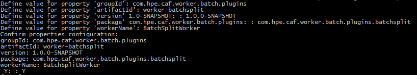

# Getting Started

This guide provides instructions for creating a Batch Worker plugin, adding the plugin to a container and then testing the Batch Worker container.

## Introduction

A Batch Worker can take batches of work, recursively break them down into smaller batches of work and then ultimately individual tasks, which are sent to other workers.

The Job Service works in conjunction with any worker from the Worker Framework, but Batch Workers are workers that are most often controlled by the Job Service.

The Job Service is particularly beneficial to the Batch Worker because it monitors the progress of the batch as a whole. Even if the size of the batch is not known in advance, using the Job Service makes it possible to monitor the overall progress of the entire batch, as well as making other operations available, such as the capability to cancel the batch.

## Components of a Batch Worker Project

Batch Worker plugin and the container are two main components that build up a Batch Worker project.

### Batch Worker Plugin module

The Batch Worker Plugin creates worker-specific task messages. The implementation depends on the structure of the batch definition and the targeted worker the messages are to be intended for. For example, the batch definition could be a list of case files. For the purposes of this Getting Started guide we will assume that a batch definition is compromised of a list of available document storage references that should be split into tasks for a downstream worker.

#### Maven Project Dependencies

The Batch Worker Plugin and Batch Worker Services interfaces ([worker-batch-extensibility](https://github.hpe.com/caf/worker-batch-extensibility)) should be included in the dependencies section of the project POM:

    <dependency>
        <groupId>com.hpe.caf.worker.batch</groupId>
        <artifactId>worker-batch-extensibility</artifactId>
        <version>1.1.0</version>
        <scope>provided</scope>
    </dependency>

#### Batch Worker Plugin Interface

The Batch Worker Plugin Java class is responsible for interpreting and recursively splitting the batch definition into individual worker items that can be sent to a queue that a target worker is listening on. The primary requirement of the Batch Worker plugin class is that it should implement the `BatchWorkerPlugin` interface defined in ([worker-batch-extensibility](https://github.hpe.com/caf/worker-batch-extensibility)):

    package com.hpe.caf.worker.batch.plugins;
    
    import ...;
    
    /**
     * Example Batch Worker Plugin
     */
    public class ExampleBatchPlugin implements BatchWorkerPlugin
    {
        @Override
        public void processBatch(BatchWorkerServices batchWorkerServices,
                                 String batchDefinition,
                                 String taskMessageType,
                                 Map<String, String> taskMessageParams)
            throws BatchDefinitionException
        {
            // Start processing the batch definition.
            ...
            
        }
    }

The author of the Batch Worker plugin class controls the structure of the batch definition supplied to the `processBatch()` method.

#### Batch Worker Services

It is the responsibility of the Batch Worker Plugin to repeatedly call the Batch Worker Services object in order to register sub-batches or individual work items. This can be done in the `processBatch()` method by making the appropriate `registerBatchSubtask()` and `registerItemSubtask()` services calls:

    @Override
    public void processBatch(BatchWorkerServices batchWorkerServices,
                             String batchDefinition,
                             String taskMessageType,
                             Map<String, String> taskMessageParams)
        throws BatchDefinitionException
    {
        // Start processing the batch definition
        ...
        
        // Determine if batch requires further splitting
        if (isSubBatchTrue) {
            // Register sub-batch
            batchWorkerServices.registerBatchSubtask(theSubbatchDefinition);
        } else {
            ...
            
            // Register individual worker item sub-task
            batchWorkerServices.registerItemSubtask(
                taskMessageToSend.getTaskClassifier(),
                taskMessageToSend.getTaskApiVersion(),
                taskMessageToSend.getTaskData());
        }
    }

### Batch Worker Container module

The Batch Worker Container module of the project consumes the Batch Worker Plugin implementation as a dependency, produces an a container from with it and runs testcase integration testing against the container with the `BatchWorkerAcceptanceIT.java` class.

The next section, [Creating a Batch Worker from Archetype](#Creating-a-Batch-Worker-from-Archetype), will create a basic Batch Worker project for you that contains both Batch Worker Plugin and Batch Worker Container modules. It is recommended that you use this as the basis of your Batch Worker.

## Creating a Batch Worker from Archetype

The Batch Worker Archetype provides a quick and easy way to generate a Batch Worker project that contains Batch Worker Plugin and Containerisation modules.

### Prerequisites

The following are prerequisite components required for the generation of a Batch Worker project from the archetype:

- Refer to the correct Maven Settings found
[here](https://github.hpe.com/caf/caf-development/tree/master/environment/maven-settings).
- Maven
- Docker VM
- IntelliJ (Optional)
- NetBeans (Optional)

#### Components Generated from the Archetype

The following modules are required to create a Batch worker. Each contains its own pom.xml with its own dependencies
and plugins:

**These modules are generated from the worker-batch-archetype:**

- `worker-<artifactId>` aggregator project that contains the following modules:
    - `worker-<artifactId>-batch-plugin` module contains the batch worker plugin.
	    - **<workerName\>BatchPlugin** – responsible for doing the work. This class implements the BatchWorkerPlugin
	interface.
    - `worker-<artifactId>-container` module is for building the Docker image of the worker and pushing the image to Docker.
The module starts a container for RabbitMQ, webdav, test-configs, the worker and runs worker acceptance integration
testcases.
	    - **<workerName\>AcceptanceIT** – calls the `worker-batch-testing` dependency's BatchTestControllerProvider class
	to generate or run worker integration testing testcase files.
	    - **pom.xml** – specifies the Docker Maven plugin configurations to build the image for the worker, and Maven
	compiler and failsafe plugin for compiling and running integration tests.

### Using the Batch Worker Archetype

A Maven Archetype is a template which you can base a project on.

Excerpt from [Apache Maven Archetype Introduction](https://maven.apache.org/guides/introduction/introduction-to-archetypes.html) :

<pre>"Archetype is a Maven project templating toolkit.
An archetype is defined as an original pattern or model from which all other things of the same kind are made."</pre>

#### Maven Archetype for Batch Worker projects

You can create the foundations of a new Batch Worker project by using the `worker-batch-archetype` project.

The generation of a new project from the Batch Worker Archetype will contain some basic functionality. It takes in a batch definition in the form of a JSON array and splits that into individual references to use in
creating Document Worker Tasks.

#### Creating a new Batch Worker from Batch Worker Archetype

A new Batch Worker aggregator project generated from the Batch Worker Archetype has a set of properties that are
shared between its submodules:

- ArtifactID
- GroupID
- Version
- Package
- WorkerName

The following subsections provide instructions on how you can use Maven Command Line Interface (CLI),
IntelliJ Integrated Development Environment (IDE) or NetBeans IDE to create the components of a Batch Worker from the
Batch Worker Archetype. *Note: You must replace __WORKER-BATCH-ARCHETYPE-VERSION__ with a valid version of
`worker-batch-archetype`.*

##### Maven CLI

The Maven CLI offers developers the ability to generate projects from archetypes with the `mvn archetype:generate`
command. The location where you run the command will be where the project is created.

###### Generate the New Batch Worker Aggregator

Generate the new Batch Worker Aggregator from the `worker-batch-archetype` with the following Maven command:
<pre>mvn archetype:generate -DarchetypeRepository=http://rh7-artifactory.svs.hpeswlab.net:8081/artifactory/hpe-mirror -DarchetypeVersion=WORKER-BATCH-ARCHETYPE-VERSION -DarchetypeArtifactId=worker-batch-archetype -DarchetypeGroupId=com.hpe.caf.worker.batch</pre>

The CLI will prompt you for artifactId, groupId, version (default suggestion is 1.0-SNAPSHOT), package (default suggestion is the
groupId, you should however adjust this to include the worker's purpose) and workerName properties required for the new Batch Worker
project. See Figure 1.

*Figure 1*

If you are satisfied with the properties you have set, confirm these by typing 'Y' else if you are not satisfied type 'N' or any other
character to re-enter property values. After confirming your properties Maven will generate the new Batch Worker Aggregator project
which will contain the following submodules:

- `<artifactId>-batch-plugin` - submodule containing the Worker's backend plugin code.
- `<artifactId>-container` - submodule containing the Worker's container and testing configurations.

##### IntelliJ IDE

IntelliJ offers developers the ability to generate projects from archetypes via its GUI.

###### Generate the New Batch Worker Aggregator

Generate the new Batch Worker Aggregator from the `worker-batch-archetype` by following these instructions:

- 'File > New > Project...'
- Select Maven from the left-hand pane > Tick 'Create from archetype' > Click 'Add Archetype...'
- Specify the details of the 'worker-batch-archetype'
	- GroupId : com.hpe.caf.worker.batch
	- ArtifactId : worker-batch-archetype
	- Version : *WORKER-BATCH-ARCHETYPE-VERSION*
	- Repository : http://rh7-artifactory.svs.hpeswlab.net:8081/artifactory/hpe-mirror
	- Click 'OK'
- Select the added 'com.hpe.caf.worker.batch:worker-batch-archetype' archetype > Click 'Next'
- Enter GroupId, ArtifactId and Version of your Worker project > Click 'Next', e.g:
	- GroupId : com.hpe.caf.worker.batch.plugins
	- ArtifactId : worker-assetid
	- Version : 1.0.0-SNAPSHOT
- Add each of the following properties (Alt+Insert) and replace the example values with your project specific values > Click 'Next':
	- package : com.hpe.caf.worker.batch.plugins.assetid
	- workerName : AssetIdWorker
- Name the Project after its ArtifactId and specify the location of the project > Click 'Finish', e.g:
	- Project name : worker-assetid
	- Project location : C:\MyWorkerProjects\worker-assetid

The foundations for your new Batch Worker is now set up. The generated project will contain the following submodules:

- `<artifactId>-batch-plugin` - submodule containing the Worker's backend plugin code.
- `<artifactId>-container` - submodule containing the Worker's container and testing configurations.

##### NetBeans IDE

NetBeans offers developers the ability to generate projects from archetypes via its GUI.

###### Generate the New Batch Worker Aggregator

Generate the new Batch Worker Aggregator from the `worker-batch-archetype` by following these instructions:

- 'File > New Project...'
- From the Categories Pane select Maven > From the Select Pane select 'Project from Archetype' > Click 'Next >'
- Specify the details of the 'worker-batch-archetype'
	- GroupId : com.hpe.caf.worker.batch
	- ArtifactId : worker-batch-archetype
	- Version : *WORKER-BATCH-ARCHETYPE-VERSION*
	- Repository : http://rh7-artifactory.svs.hpeswlab.net:8081/artifactory/hpe-mirror
	- Click 'Next >'
- Enter Project Name, Project Location, GroupId, Version and Package of your Worker project, e.g:
	- Project Name : worker-assetid
	- Project Location : C:\MyWorkerProjects
	- GroupId : com.hpe.caf.worker.batch.plugins
	- Version : 1.0.0-SNAPSHOT
	- Package : com.hpe.caf.worker.batch.plugins.assetid
- Set workerName property > Click 'Finish', e.g:
	- workerName : AssetIdWorker

The foundations for your new Batch Worker is now set up. The generated project will contain the following submodules:

- `<artifactId>-batch-plugin` - submodule containing the Worker's backend plugin code.
- `<artifactId>-container` - submodule containing the Worker's container and testing configurations.

### Further Information

Information on worker-batch and its modules that the archetype utilizes can be found [here](https://github.hpe.com/caf/worker-batch/blob/develop/README.md).

At the time this guide was written with:

- Apache Maven 3.3.3
- NetBeans 8.1
- IntelliJ 15

## Testing the Batch Worker

For the purposes of getting started, this section assumes a new example Batch Worker Plugin has been created using the archetype. It assumes a batch definition comprising a list of document storage references is to be used. The `processBatch()` method of the plugin is expected to recursively split the list of document storage references (passed via the `batchDefinition`) until individual worker items for a single document storage reference can be sent to a target worker. The target worker in this case is expected to be a Document Worker.

The Job Service can be employed to test the Batch Worker plugin created. The Job Service can send and monitor the progress of a batch of work sent to a Batch Worker. The message to be sent to the Batch Worker should include a batch definition comprising a list of document storage references as well as the target batch processor plugin (this is the name of the class that implements the Batch Worker plugin interface). The Job Tracking Worker will also be deployed alongside the Job Service and the logs belonging to this worker can be utilised to verify the Batch Worker plugin implementation.

### Job Service and Batch Worker Deployment

Follow the deployment instructions for the Job Service, Job Tracking Worker and Batch Worker in the [Getting Started guide for the Job Service](https://pages.github.hpe.com/caf/job-service/pages/en-us/Getting-Started).

#### Sending a Job to the Batch Worker

A Swagger user interface (UI) is provided on the same host and port as the Job Service. Usage instructions are provided in the [Getting Started guide for the Job Service](https://pages.github.hpe.com/caf/job-service/pages/en-us/Getting-Started).

You can use the Swagger UI to send the Batch Worker a batch of work. Add a job with the new job body following this template:

    {
      "name": "ExampleBatchPlugin_Job_1",
      "description": "example-batch-worker-plugin-test",
      "externalData": "",
      "task": {
          "taskClassifier": "BatchWorker",
          "taskApiVersion": 1,
          "taskData": {
              "batchType": "AssetIdWorkerBatchPlugin",
              "batchDefinition": "[\"storageRef1\",\"storageRef2\",\"storageRef3\",\"storageRef4\"]",
              "taskMessageType": "DocumentMessage",
              "taskMessageParams": {
                  "referenceFieldName": "REFERENCE"
              },
              "targetPipe": "downstream-document-worker-in"
          },
          "taskDataEncoding": "utf8",
          "taskPipe": "dataprocessing-batch-in",
          "targetPipe": "downstream-document-worker-out"
        }
    }

Note the following:

* The `name` and `description` fields are just informational.
* The `externalData` field can be used to store information that you want associated with the job but that has no effect on it.
* The `taskClassifier` field specifies the type of message being sent. This must be set to `BatchWorker` as you are sending the job to a Batch Worker.
* The `taskApiVersion` field specifies the contract version. Set this to 1.
* The `taskData` field should contain the actual message that is to be sent to the Batch Worker and should be JSON-encoded.
  * In the template above, we are adding a batch definition comprising a list of storage references.
  * The `batchType` field specifies the plugin to be used so set this to the name of your Batch Worker plugin.
  * The `taskMessageType` field indicates the task message builder implementation to use, in this case `DocumentMessage` is used as the plugin that the archetype produces builds and sends messages intended for Document Workers.
* The `taskDataEncoding` field specifies how the value of the `taskData` field should be encoded. Set this to utf8.
* The `taskPipe` field specifies the queue where the message is to be forwarded to. Set this to the queue consumed by the Batch Worker, `dataprocessing-batch-in`.
* The `targetPipe` field specifies the ultimate pipe where messages should arrive after processing. Set this to the name of the final worker where tracking will stop, in this case, `downstream-document-worker-out`.

#### Job Verification

After the job has been created, the Swagger UI can be used to track the progress and status of the job using the GET /jobs method.

On completion, the payload sent to the downstream Document Worker output queue, `downstream-document-worker-out`, will look similar to the following:

    {
        "version": 3,
        "taskId": "7.1.1",
        "taskClassifier": "DocumentWorker",
        "taskApiVersion": 1,
        "taskData": "{"workerStatus":"COMPLETED","textData":{"reference":null,"data":"U29tZSBkYXRhIHJlbGF0aXZlIHRvIHRoZSBkb3duc3RyZWFtIHdvcmtlcg=="}}",
        "taskStatus": "RESULT_SUCCESS",
        "context": {},
        "to": "downstream-document-worker-out",
        "tracking": null,
        "sourceInfo": {
            "name": "DocumentWorker",
            "version": "1.0.2"
        }
    }

The logs of the Job Tracking Worker can also be inspected to verify the processing of the original message or batch of work sent to the Batch Worker. The [Getting Started guide for the Job Service](https://pages.github.hpe.com/caf/job-service/pages/en-us/Getting-Started) explains how to locate the stdout output for the job tracking worker. You can use this to verify the following:

* Message is registered and split into separate tasks by the batch worker
* Separate messages directed back to the batch worker output queue for recursive splitting
* Separate messages are forwarded to the document worker input queue
* Job status check returns Active for separated messages
* Job status check returns Completed for separated messages
* Separate messages forwarded to the example worker output queue