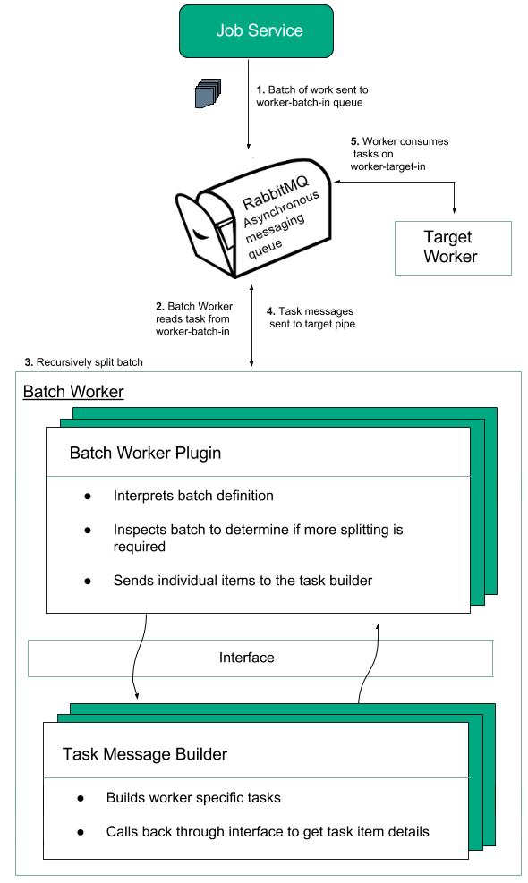

# Architecture

The batch worker is a microservice designed to take a batch of work and recursively break it down into a set of smaller sub-batches or individual tasks for workers to act on.
 
## Overview

The figure below illustrates the overall flow and relationship of components involved in breaking batches of work down into smaller units of work until individual tasks are produced and sent to workers. The Job Service is included as it can send and monitor the progress of a batch of work as a whole.

1. The Job Service sends a batch of work to RabbitMQ, which is the Asynchronous messaging service to be consumed by the batch worker. In this case, the batch is sent to worker-batch-in.
2. The batch worker consumes the tasks from worker-batch-in.
3. The batch worker constructs an instance of the Batch Worker Plugin which it uses to interpret the incoming batch definition. The batch worker then recursively splits the batch definition into work items small enough for individual workers and generates task messages using the Task Message Builder for each of these.
4. The task messages are sent to the target pipe, in this case, worker-target-in. 
5. The target worker consumes messages from the target pipe and processes the task. In this case, the target worker consumes from worker-target-in.

## Batch Worker

When the Batch Worker receives a `BatchWorkerTask` to process, it constructs instances of objects that implement both the `BatchWorkerServices` and `BatchWorkerPlugin` interfaces respectively. The latter interprets the `batchDefinition` field of a `BatchWorkerTask` and then utilises the services provided by the former to register either sub-batches or individual worker item task messages. Sub-batches are directed back again to the Batch Worker whereas the worker item messages are forwarded to the target worker for further processing.

### BatchWorkerTask

The Batch Worker input task message comprises the following:

- `batchDefinition` - definition of the batch to be processed
- `batchType` - type of plugin to use to interpret the batch definition string
- `taskMessageType` - factory type that is used to construct the task message for each worker item of the batch
- `taskMessageParams` - additional parameters to be sent to the worker
- `targetPipe` - specifies the RabbitMQ queue where worker specific item task messages are to be forwarded to

### BatchWorkerServices
The Batch Worker constructs its own internal object which implements the `BatchWorkerServices` interface. This provides services for registering either sub-batches or individual work items.

The Batch Worker plugin, which is described next, will make a series of calls to the `BatchWorkerServices` object to register smaller batches or individual items. The Batch Worker in turn will then direct any sub-batches back to itself via the input queue that the Batch Worker itself is listening on. For individual items however, the Batch Worker will send them to the input queue that the target worker is listening on and this is specified by the `targetPipe` field of a `BatchWorkerTask`.

### Batch Worker Plugin
Batch Worker plugins are implemented to handle incoming batch definitions. They are responsible for decoding the String representation of the batch and translating it into individual items or smaller sub-batches.

When the Batch Worker receives a `BatchWorkerTask` it inspects the `batchType` field to identify the appropriate `BatchWorkerPlugin` implementation to use to process the batch.  It supplies the `BatchWorkerServices` object along with the `batchDefinition`, `taskMessageType` and `taskMessageParams` fields of the `BatchWorkerTask` to the plugin.  The plugin interprets the batch definition string and splits it up into either a set of batch definitions representing smaller batches OR a set of individual items.

##### Smaller Batches
If the Batch Worker Plugin determines to split the batch into a set of smaller batches, it will make a series of calls to the `BatchWorkerServices` object to register each sub-batch. The Batch Worker will construct messages which are then directed back towards itself with revised batch definition strings representing the smaller batches.

##### Individual Items & Task Message Builder
If the Batch Worker Plugin instead determines to split the batch into a set of items, the plugin will first construct an instance of the type that is specified by the `taskMessageType` field of a `BatchWorkerTask`. This represents a Task Message Builder and is responsible for creating worker specific task messages for each individual item. The message builder calls back through the interface in order to retrieve task item details that are needed for the worker message construction. The plugin will then make a series of calls to the `BatchWorkerServices` object to register the item messages. The Batch Worker will dispatch the messages to the queue specified by the `targetPipe` field of the `BatchWorkerTask`.

### Parallel Processing
The process of batch splitting is scaled elastically with the Autoscaler service, allowing sub-batches of a larger batch to process in parallel. The individual items of work emerge and go to the RabbitMQ queue, which are then processed by workers. The workers also scale elastically based on the load.
