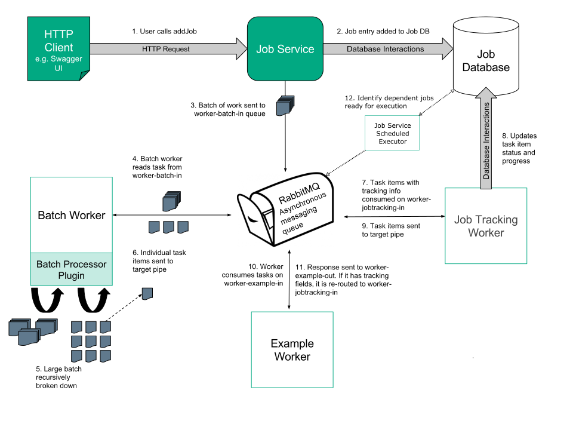
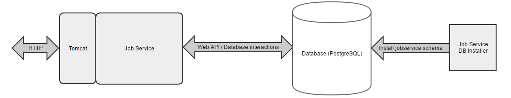

# Architecture

The Job Service is a REST web service that sends operations to workers, checks on the progress of these operations, and allows operations to be cancelled. The following high-level architecture description explains the relationship of the components that work alongside the Job Service to allow for greater control over the tracking and control of background operations. The Job Service is designed to allow wider use of the Worker Framework for complex operations that take a significant length of time to complete.

## Overview

The figure below illustrates the overall flow and relationship of components in the Job Service.

The pipes represent asynchronous message queues on RabbitMQ.

1. The processing of jobs begins with HTTP requests sent to the Job Service through an http client or the Job Service Swagger user interface.
2. The Job Service adds entries to the database for the newly created jobs.
3. The batch of work is sent to RabbitMQ, which is the Asynchronous messaging service to be consumed by the batch worker. In this case, the batch is sent to worker-batch-in.
4. The batch worker consumes the tasks from worker-batch-in.
5. The large batch of work is recursively broken down into smaller and smaller work items until they are small enough for individual workers. Since the batch worker is recursive in nature, tasks that are still too large are sent back into the worker-batch-in queue for re-processing.
6. The smaller task items are sent to the target pipe, in this case, worker-example-in. Due to the presence of tracking fields, the task is re-routed to the job tracking worker through the worker-jobtracking-in queue.
7. The job tracking worker consumes work items from the tracking pipe, worker-jobtracking-in.
8. The job tracking worker updates task status for the work item in the job database.
9. The job tracking worker makes a decision:
 - If the `to` field is the same as the `trackTo` field, the task is marked complete in the database and sent to the target pipe without tracking information.
 - Otherwise, the task is sent to the target pipe with tracking information and processed by the worker consuming from the target pipe.
10. A worker consumes messages from the target pipe and processes the task. In this case, the example worker consumes from worker-example-in.
11. If tracking information is present, tasks are re-routed to the tracking pipe. Otherwise, the task has completed and the response is sent to the output queue, in this case, worker-example-out.

## Job Service

As shown in the figure, the Job Service runs in a container with a base Tomcat image. 

It acts as the entry-point for background operations to be initiated, tracked, and cancelled.

Users interact with the Swagger user interface page to make GET, POST, PUT and DELETE HTTP requests to the Job Service, which in turn interacts with the Job Service database and returns responses to the user.

The specification for the Job Service web API is defined in the [swagger.yaml](https://github.com/JobService/job-service/tree/develop/job-service-contract/src/main/resources/com/hpe/caf/services/job/swagger.yaml) file in the [job-service-contract](https://github.com/JobService/job-service/tree/develop/job-service-contract) project.

The Job Service itself is stateless, which means it can be auto-scaled in future.

## Batch Worker

The batch worker is an unusual worker because it may dispatch multiple messages for each message it receives. Most workers dispatch a single completion or failure message for each work packet sent to them.

Upon providing a batch processor plugin, a batch can be interpreted by the batch worker, splitting it into smaller batches or individual items of work upon which the service can act. The process of batch splitting is scaled elastically with the autoscaler, allowing sub-batches of a larger batch to process in parallel. The individual items of work emerge and go to the RabbitMQ queue, which is defined in the job and processed by workers. The workers also scale elastically based on the load.

### Batch Worker Walk-through

When the batch worker receives a batch to process, it interprets the batch definition string and splits it up into either of the following:

- a set of batch definitions representing smaller batches
- a set of items

If it splits the batch into a set of smaller batches, then it constructs messages, which are directed back towards itself, and dispatches them to the input pipe to which the batch worker itself listens on (not to the pipe specified by the `targetPipe` field).

If it instead splits the batch into a set of items, then it generates and dispatches task messages to the `targetPipe`.

## Worker Framework

When a worker receives a message for processing, then the Worker Framework first compares the current time to the time specified in the statusCheckTime field. If the expiry time has passed, then the statusCheckUrl is used to re-check the job status.

* If the job has been cancelled or aborted, then the message is simply discarded and not processed.
* If the specified URL could not be reached for some reason, then this failure is logged as a warning, but the work package still progresses on the assumption that the job is still active.
* If the job is confirmed to still be active, then the work package progresses, and, when the worker ultimately dispatches another message relating to this task, it has the statusCheckTime field updated to a new value. Consequently, a downstream worker may not have to repeat this work and check the job status again.

The `to` field is automatically set by the Worker Framework as the destination pipe, where the sender intends the message to be sent.

After the Worker Framework checks that the task is still active, but before it instantiates the actual worker code, the framework checks the `to` field to confirm that the message was actually intended for this worker.

* If the message was intended for it (that is, the `to` field is set to the pipe that the worker is consuming), then the Worker Framework continues to process the message as normal, using the existing interfaces.
* If the message was not intended for it (that is, the `to` field is not set to the pipe that the worker is consuming), then the Worker Framework re-routes the message to the destination pipe.

## Job Tracking Worker

The job tracking worker is special because it is both:

- a normal worker that receives messages intended for it, although they are event messages rather than document messages
- a proxy worker that routes messages not ultimately intended for it to the correct workers, although the actual message forwarding is done by the Worker Framework

Messages typically come to the job tracking worker because the pipe from which the worker consumes messages is specified as the `trackingPipe`. The Worker Framework is triggered to re-route output messages to the job tracking worker, if the tracking fields are present.

When the job tracking worker receives a success message to be proxied (that is, the taskStatus is RESULT_SUCCESS or NEW_TASK and the `to`  field is not the pipe that the worker itself is listening on), then the worker checks whether the `trackTo`  pipe is the same as the `to`  pipe.

* If the pipes match, then the task is complete and marked as such in the job database.
* If not, then the job database is updated to reflect that the task is still progressing but not yet complete.

The job tracking worker recognizes failure and retry messages, which are being proxied, and updates the job database accordingly.

## Job Database

Job information is stored in a **PostgreSQL** database.

### Job Table

This table stores information on the jobs that are requested. Entries are added by the Job Service and updated by the job tracking worker.

| **Column**     | **Data Type** | **Nullable?** | **Primary Key?** |
|----------------|---------------|---------------|------------------|
| JobId          | String        | No            | Yes              |
| Name           | String        | Yes           |                  |
| Description    | String        | Yes           |                  |
| Data           | String        | Yes           |                  |
| Create_Date    | DateTime      | No            |                  |
| JobStatus      | job_status    | No            |                  |
| FailureDetails | ---           | Yes           |                  |
| IsComplete     | Boolean       | Yes           |                  |
| Job_Hash       | Integer       | Yes           |                  |

### Task Tables

The task tables have the same structure as the job table. Each job has one task table, which is created when the first subtask is reported, and deleted when the job completes successfully. If the job fails, the table is retained for a period of time for examination.

When a task is marked complete, the system checks whether the parent task (or the job if it is the top level) can also be marked complete.
