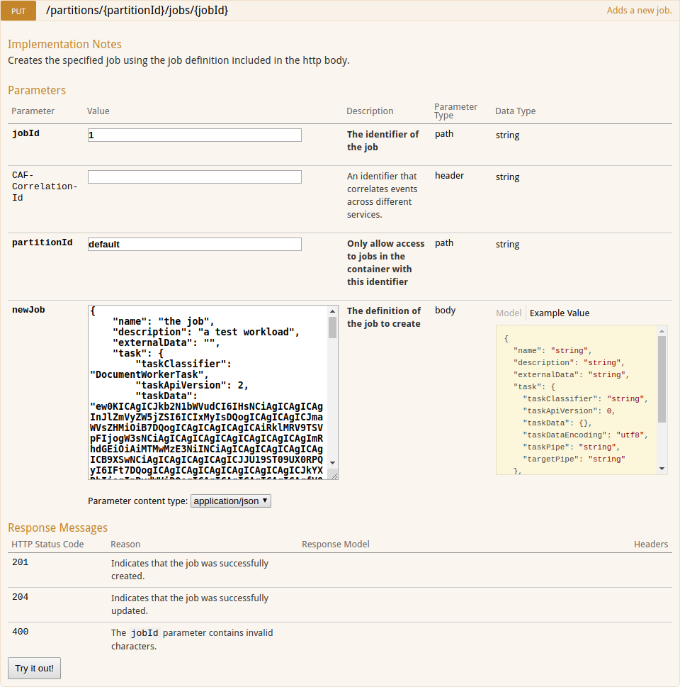

# Getting Started

## Deploying the Job Service with Chateau

**[Chateau](https://github.hpe.com/caf/chateau)** can launch workers and services, such as the Job Service.

- To download and set up Chateau, follow the instructions in the [README.md](https://github.hpe.com/caf/chateau/blob/develop/README.md). 

- Installation instructions for the Job Service database can be found [here](https://github.hpe.com/caf/chateau/blob/develop/services/job-service/README.md).

- To deploy the Job Service and job tracking worker, follow the [Service Deployment](https://github.hpe.com/caf/chateau/blob/develop/deployment.md) guide and use the following option with the deployment shell script.

  `./deploy-service.sh job-service`

## Using the Job Service Web User Interface

A handy user interface is provided on the same host and port as the web service. The Swagger user interface page is accessible from the following address:

`<job-service-web-service-url>/job-service-ui`

### Adding a Job

1. Expand the PUT /jobs/{jobId} method. 
2. Enter a value for jobId. 
3. Click on the example value box on the right to fill in the new job body. 
4. Edit these fields with your own details:
 
 `name`: name of the job <br>
  `description`: description of the job <br>
  `externalData`: external data <br>
  `taskClassifier`: classifier of the task <br>
  `taskApiVersion`: API version of the task <br>
  `taskData`: data of the task (include a batch definition if sending to the batch worker) <br>
  `taskDataEncoding`: encoding of the task data, for example, `utf8` <br>
  `taskPipe`: name of the RabbitMQ queue feeding messages to the first worker <br>
  `targetPipe`: name of the final worker's output queue where tracking will stop

5. Press `Try it out!`. The resulting code will show whether the addition of the job succeeds or not. 
   - 201, if the job is successfully added
   - 204, if the job is successfully updated



### Getting Jobs

1. Expand the GET /jobs method. 
2. Press `Try it out!`. The list of jobs in the system appears in the response body, including the job you just created.


## Deploying an End-To-End System

In order to test an end-to-end Job Service system, you need to deploy and run:

- the Job Service (see _Deploying the Job Service with Chateau_)
- a job tracking worker (see _Deploying the Job Service with Chateau_)
- a batch worker 
- another service to send the tasks to, in this case, the example worker.

### Batch Worker

You can deploy the batch worker with Chateau.

Prerequisites for running the batch worker can be found [here](https://github.hpe.com/caf/chateau/blob/develop/services/batch-worker/README.md).

The following command with the deployment script deploys a batch worker:

`./deploy-service.sh batch-worker`

### Example Worker

You can deploy the example worker using Chateau.

Prerequisites for running the example worker can be found [here](https://github.hpe.com/caf/chateau/blob/develop/services/example-worker/README.md).

The following command with the deployment script deploys an example worker:

`./deploy-service.sh example-worker`

You can view the status of the services on Marathon at the following URL:

`<marathon-endpoint>/ui/#`

The figure shows you the health of the workers and services:


You also need dummy data in a datastore and a storage reference to this data. Dummy data can be uploaded from the document-generator. For more information on using the document generator, see the [README.md](https://github.hpe.com/caf/policy-worker/blob/develop/PolicyWorkerDocumentGenerator/README.md).

### Send a Job

Open the Swagger user interface as explained under _Using the Job Service Web User Interface_.

Add a job with the new job body following this template:

```
{
  "name": "Job_1",
  "description": "end-to-end",
  "externalData": "string",
  "task": {
    "taskClassifier": "BatchWorker",
    "taskApiVersion": 1,
    "taskData": "{\"batchDefinition\":\"[\\\"2f0e1a924d954ed09966f91d726e4960/fda3cf959a1d456b8d54800ba9e9b2f5\\\",\\\"02f0e1a924d954ed09966f91d726e4960/fda3cf959a1d456b8d54800ba9e9b2f5\\\"]\",\"batchType\":\"AssetIdBatchPlugin\",\"taskMessageType\":\"ExampleWorkerTaskBuilder\",\"taskMessageParams\":{\"datastorePartialReference\":\"2f0e1a924d954ed09966f91d726e4960\",\"action\":\"REVERSE\"},\"targetPipe\":\"dataprocessing-example-in\"}",
    "taskDataEncoding": "utf8",
    "taskPipe": "dataprocessing-batch-in",
    "targetPipe": "dataprocessing-example-out"
    
  }
}
```

Note the following:

* `TaskClassifier` must be set to `BatchWorker` as you are sending the job to the batch worker.
* Set the `taskApiVersion` to 1.
* For the `taskData`, we are adding a batch definition with a storage reference and the `datastorePartialReference` is the container ID. This storage reference is the reference to the dummy data stored using document generator.
* Set `taskPipe` to the queue consumed by the first worker to which you want to send the work, in this case, the batch worker `dataprocessing-batch-in`. The batch can then be broken down into task items.
* Set `targetPipe` to the name of the final worker where tracking will stop, in this case, `dataprocessing-example-out`.

### Verification of correct setup

The message output to the example worker output queue, demo-example-out, contains no tracking information. The payload for the messages sent to RabbitMQ will look similar to the following. Notice that `tracking` is `null`.

```
{"version":3,"taskId":"j_demo_1.1","taskClassifier":"ExampleWorker","taskApiVersion":1,"taskData":"eyJ3b3JrZXJTdGF0dXMiOiJDT01QTEVURUQiLCJ0ZXh0RGF0YSI6eyJyZWZlcmVuY2UiOm51bGwsImRhdGEiOiJBQUFBQUFEdnY3MEFBQUR2djcwQUF3QURBQUFBQUFZRlMxQjBlSFF1TTJOdlpIUnpaWFFBQUFCa0FBQUFJQUFCQUFBQUFBQUFBQXdBQUFBSUFBQUFDQlB2djczdnY3MGFTQ2hhVkFBQUFBQUFGQUFVQWdGTFVIUjRkQzR5WTI5a2RITmxkQUFBQURJQUFBQWdBQUVBQUFBQUFBQUFEQUFBQUFnQUFBQUlaTysvdmUrL3ZlKy92VWdvV2swQUFBQUFBQlFBRkFJQlMxQjBlSFF1TVdOdlpIUnpaWFFBQUFBQUFBQUFJQUFCQUFBQUFBQUFBQXdBQUFBSUFBQUFDTysvdmM2VE5rZ29Xa1VBQUFBQUFCUUFGQUlCUzFBelkyOWtkSE5sZEhSNGRDNHpZMjlrZEhObGRBQUFBQXdBQUFBSUFBQUFDQlB2djczdnY3MGFTQ2hhVkFBQUFBQUFGQVFEUzFBeVkyOWtkSE5sZEhSNGRDNHlZMjlrZEhObGRBQUFBQXdBQUFBSUFBQUFDR1R2djczdnY3M3Z2NzFJS0ZwTkFBQUFBQUFVQkFOTFVERmpiMlIwYzJWMGRIaDBMakZqYjJSMGMyVjBBQUFBREFBQUFBZ0FBQUFJNzcrOXpwTTJTQ2hhUlFBQUFBQUFGQVFEUzFBPSJ9fQ==","taskStatus":"RESULT_SUCCESS","context":{},"to":"demo-example-out","tracking":null,"sourceInfo":{"name":"ExampleWorker","version":"1.0-SNAPSHOT"}}
```

The figure shows how to locate the stdout output for the job tracking worker, after clicking on the job tracking application in Marathon.


Open the stdout log file for the job tracking worker and verify the following:

* Message is registered and split into separate tasks by the batch worker.
* Separate messages are forwarded to the example worker input queue.
* Job status check returns Active for separated messages.
* Single message forwarded to the batch worker output queue.
* Job status check returns Completed for separated messages.
* Separate messages forwarded to the example worker output queue.
* Tracking information is removed from separate messages.

The output log should look something like this:

```
DEBUG [2016-06-29 16:21:44,765] com.hpe.caf.worker.queue.rabbit.WorkerQueueConsumerImpl: Registering new message 22
DEBUG [2016-06-29 16:21:44,766] com.hpe.caf.worker.core.WorkerCore: Received task j_demo_1.1 (message id: 22)
DEBUG [2016-06-29 16:21:44,766] com.hpe.caf.worker.core.WorkerCore: Task j_demo_1.1 active status is not being checked - it is not yet time for the status check to be performed: status check due at Wed Jun 29 16:21:49 UTC 2016
DEBUG [2016-06-29 16:21:44,766] com.hpe.caf.worker.core.WorkerCore: Task j_demo_1.1 (message id: 22) is not intended for this worker: input queue demo-jobtracking-in does not match message destination queue demo-example-in
DEBUG [2016-06-29 16:21:44,766] com.hpe.caf.worker.jobtracking.JobTrackingWorkerReporter: Connecting to database jdbc:postgresql://16.49.191.34:5432/jobservice ...
INFO  [2016-06-29 16:21:44,793] com.hpe.caf.worker.jobtracking.JobTrackingWorkerReporter: Reporting progress of job task j_demo_1.1 with status Active ...
DEBUG [2016-06-29 16:21:44,999] com.hpe.caf.worker.jobtracking.JobTrackingWorkerFactory: Forwarding task j_demo_1.1
DEBUG [2016-06-29 16:21:44,999] com.hpe.caf.worker.core.WorkerCore: Task j_demo_1.1 (message id: 22) being forwarded to queue demo-example-in
DEBUG [2016-06-29 16:21:45,001] com.hpe.caf.worker.queue.rabbit.WorkerPublisherImpl: Publishing message with ack id 22
DEBUG [2016-06-29 16:21:45,001] com.hpe.caf.worker.queue.rabbit.WorkerConfirmListener: Listening for confirmation of publish sequence 22 (ack message: 22)
DEBUG [2016-06-29 16:21:45,002] com.hpe.caf.worker.queue.rabbit.WorkerQueueConsumerImpl: Registering new message 23
DEBUG [2016-06-29 16:21:45,002] com.hpe.caf.worker.core.WorkerCore: Received task j_demo_1.2 (message id: 23)
DEBUG [2016-06-29 16:21:45,002] com.hpe.caf.worker.core.WorkerCore: Task j_demo_1.2 active status is not being checked - it is not yet time for the status check to be performed: status check due at Wed Jun 29 16:21:49 UTC 2016
DEBUG [2016-06-29 16:21:45,003] com.hpe.caf.worker.core.WorkerCore: Task j_demo_1.2 (message id: 23) is not intended for this worker: input queue demo-jobtracking-in does not match message destination queue demo-example-in
DEBUG [2016-06-29 16:21:45,003] com.hpe.caf.worker.jobtracking.JobTrackingWorkerReporter: Connecting to database jdbc:postgresql://16.49.191.34:5432/jobservice ...
DEBUG [2016-06-29 16:21:45,006] com.hpe.caf.worker.queue.rabbit.WorkerConfirmListener: RabbitMQ broker ACKed published sequence id 22 (multiple: false)
INFO  [2016-06-29 16:21:45,029] com.hpe.caf.worker.jobtracking.JobTrackingWorkerReporter: Reporting progress of job task j_demo_1.2* with status Active ...
DEBUG [2016-06-29 16:21:45,069] com.hpe.caf.worker.jobtracking.JobTrackingWorkerFactory: Forwarding task j_demo_1.2
DEBUG [2016-06-29 16:21:45,069] com.hpe.caf.worker.core.WorkerCore: Task j_demo_1.2 (message id: 23) being forwarded to queue demo-example-in
DEBUG [2016-06-29 16:21:45,071] com.hpe.caf.worker.queue.rabbit.WorkerQueueConsumerImpl: Acknowledging message 22
DEBUG [2016-06-29 16:21:45,072] com.hpe.caf.worker.queue.rabbit.WorkerPublisherImpl: Publishing message with ack id 23
DEBUG [2016-06-29 16:21:45,072] com.hpe.caf.worker.queue.rabbit.WorkerConfirmListener: Listening for confirmation of publish sequence 23 (ack message: 23)
DEBUG [2016-06-29 16:21:45,076] com.hpe.caf.worker.queue.rabbit.WorkerQueueConsumerImpl: Registering new message 24
DEBUG [2016-06-29 16:21:45,077] com.hpe.caf.worker.core.WorkerCore: Received task ec9c4556-4753-478b-a714-bd57fde837b5 (message id: 24)
DEBUG [2016-06-29 16:21:45,077] com.hpe.caf.worker.core.WorkerCore: Task ec9c4556-4753-478b-a714-bd57fde837b5 active status is not being checked - it is not yet time for the status check to be performed: status check due at Wed Jun 29 16:21:49 UTC 2016
DEBUG [2016-06-29 16:21:45,077] com.hpe.caf.worker.core.WorkerCore: Task ec9c4556-4753-478b-a714-bd57fde837b5 (message id: 24) is not intended for this worker: input queue demo-jobtracking-in does not match message destination queue demo-batch-out
DEBUG [2016-06-29 16:21:45,077] com.hpe.caf.worker.jobtracking.JobTrackingWorkerReporter: Connecting to database jdbc:postgresql://16.49.191.34:5432/jobservice ...
DEBUG [2016-06-29 16:21:45,078] com.hpe.caf.worker.queue.rabbit.WorkerConfirmListener: RabbitMQ broker ACKed published sequence id 23 (multiple: false)
INFO  [2016-06-29 16:21:45,108] com.hpe.caf.worker.jobtracking.JobTrackingWorkerReporter: Reporting progress of job task j_demo_1 with status Active ...
DEBUG [2016-06-29 16:21:45,124] com.hpe.caf.worker.jobtracking.JobTrackingWorkerFactory: Forwarding task ec9c4556-4753-478b-a714-bd57fde837b5
DEBUG [2016-06-29 16:21:45,124] com.hpe.caf.worker.core.WorkerCore: Task ec9c4556-4753-478b-a714-bd57fde837b5 (message id: 24) being forwarded to queue demo-batch-out
DEBUG [2016-06-29 16:21:45,130] com.hpe.caf.worker.queue.rabbit.WorkerPublisherImpl: Publishing message with ack id 24
DEBUG [2016-06-29 16:21:45,130] com.hpe.caf.worker.queue.rabbit.WorkerConfirmListener: Listening for confirmation of publish sequence 24 (ack message: 24)
DEBUG [2016-06-29 16:21:45,130] com.hpe.caf.worker.queue.rabbit.WorkerQueueConsumerImpl: Acknowledging message 23
DEBUG [2016-06-29 16:21:45,132] com.hpe.caf.worker.queue.rabbit.WorkerConfirmListener: RabbitMQ broker ACKed published sequence id 24 (multiple: false)
DEBUG [2016-06-29 16:21:45,133] com.hpe.caf.worker.queue.rabbit.WorkerQueueConsumerImpl: Acknowledging message 24
DEBUG [2016-06-29 16:21:47,955] com.hpe.caf.worker.queue.rabbit.WorkerQueueConsumerImpl: Registering new message 25
DEBUG [2016-06-29 16:21:47,957] com.hpe.caf.worker.core.WorkerCore: Received task j_demo_1.1 (message id: 25)
DEBUG [2016-06-29 16:21:47,957] com.hpe.caf.worker.core.WorkerCore: Task j_demo_1.1 active status is not being checked - it is not yet time for the status check to be performed: status check due at Wed Jun 29 16:21:49 UTC 2016
DEBUG [2016-06-29 16:21:47,958] com.hpe.caf.worker.core.WorkerCore: Task j_demo_1.1 (message id: 25) is not intended for this worker: input queue demo-jobtracking-in does not match message destination queue demo-example-out
DEBUG [2016-06-29 16:21:47,959] com.hpe.caf.worker.jobtracking.JobTrackingWorkerReporter: Connecting to database jdbc:postgresql://16.49.191.34:5432/jobservice ...
INFO  [2016-06-29 16:21:47,989] com.hpe.caf.worker.jobtracking.JobTrackingWorkerReporter: Reporting progress of job task j_demo_1.1 with status Completed ...
DEBUG [2016-06-29 16:21:48,020] com.hpe.caf.worker.jobtracking.JobTrackingWorkerFactory: Forwarding task j_demo_1.1
DEBUG [2016-06-29 16:21:48,020] com.hpe.caf.worker.core.WorkerCore: Task j_demo_1.1 (message id: 25) being forwarded to queue demo-example-out
DEBUG [2016-06-29 16:21:48,020] com.hpe.caf.worker.core.WorkerCore: Task j_demo_1.1 (message id: 25): removing tracking info from this message as tracking ends on publishing to the queue demo-example-out.
DEBUG [2016-06-29 16:21:48,024] com.hpe.caf.worker.queue.rabbit.WorkerPublisherImpl: Publishing message with ack id 25
DEBUG [2016-06-29 16:21:48,024] com.hpe.caf.worker.queue.rabbit.WorkerConfirmListener: Listening for confirmation of publish sequence 25 (ack message: 25)
DEBUG [2016-06-29 16:21:48,026] com.hpe.caf.worker.queue.rabbit.WorkerConfirmListener: RabbitMQ broker ACKed published sequence id 25 (multiple: false)
DEBUG [2016-06-29 16:21:48,027] com.hpe.caf.worker.queue.rabbit.WorkerQueueConsumerImpl: Acknowledging message 25
DEBUG [2016-06-29 16:21:49,246] com.hpe.caf.worker.queue.rabbit.WorkerQueueConsumerImpl: Registering new message 26
DEBUG [2016-06-29 16:21:49,247] com.hpe.caf.worker.core.WorkerCore: Received task j_demo_1.2 (message id: 26)
DEBUG [2016-06-29 16:21:49,247] com.hpe.caf.worker.core.WorkerCore: Task j_demo_1.2 active status is not being checked - it is not yet time for the status check to be performed: status check due at Wed Jun 29 16:21:49 UTC 2016
DEBUG [2016-06-29 16:21:49,247] com.hpe.caf.worker.core.WorkerCore: Task j_demo_1.2 (message id: 26) is not intended for this worker: input queue demo-jobtracking-in does not match message destination queue demo-example-out
DEBUG [2016-06-29 16:21:49,247] com.hpe.caf.worker.jobtracking.JobTrackingWorkerReporter: Connecting to database jdbc:postgresql://16.49.191.34:5432/jobservice ...
INFO  [2016-06-29 16:21:49,274] com.hpe.caf.worker.jobtracking.JobTrackingWorkerReporter: Reporting progress of job task j_demo_1.2* with status Completed ...
DEBUG [2016-06-29 16:21:49,298] com.hpe.caf.worker.jobtracking.JobTrackingWorkerFactory: Forwarding task j_demo_1.2
DEBUG [2016-06-29 16:21:49,298] com.hpe.caf.worker.core.WorkerCore: Task j_demo_1.2 (message id: 26) being forwarded to queue demo-example-out
DEBUG [2016-06-29 16:21:49,298] com.hpe.caf.worker.core.WorkerCore: Task j_demo_1.2 (message id: 26): removing tracking info from this message as tracking ends on publishing to the queue demo-example-out.
DEBUG [2016-06-29 16:21:49,301] com.hpe.caf.worker.queue.rabbit.WorkerPublisherImpl: Publishing message with ack id 26
DEBUG [2016-06-29 16:21:49,301] com.hpe.caf.worker.queue.rabbit.WorkerConfirmListener: Listening for confirmation of publish sequence 26 (ack message: 26)
DEBUG [2016-06-29 16:21:49,306] com.hpe.caf.worker.queue.rabbit.WorkerConfirmListener: RabbitMQ broker ACKed published sequence id 26 (multiple: false)
DEBUG [2016-06-29 16:21:49,306] com.hpe.caf.worker.queue.rabbit.WorkerQueueConsumerImpl: Acknowledging message 26
```

## Links

For more information on Chateau, go [here](https://github.hpe.com/caf/chateau).

For more information on Job Service templates, and configuration and property files, see [here](https://github.hpe.com/caf/chateau/blob/develop/services/job-service/README.md).

For more information on batch worker templates, and configuration and property files, see [here](https://github.hpe.com/caf/chateau/blob/develop/services/batch-worker/README.md).

